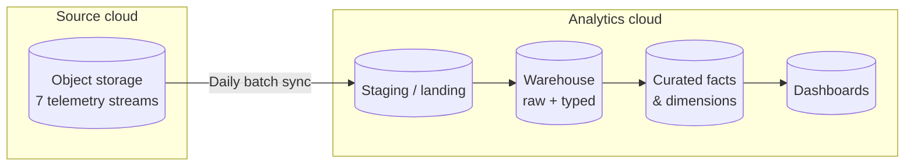
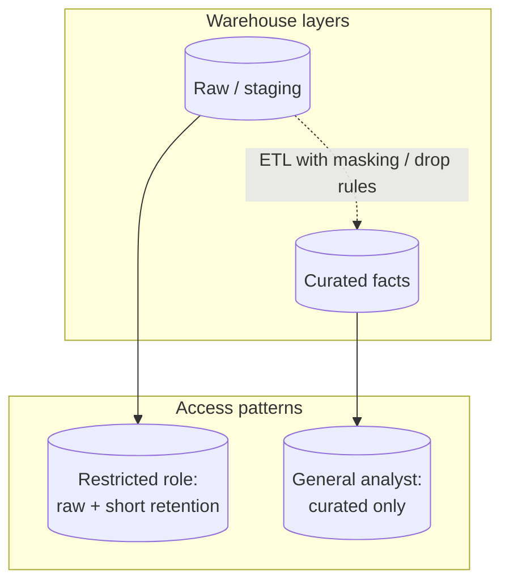

# Building an End-to-End Data Platform for a Multi-Brand Conversational AI Assistant

## Executive summary

I served as the end-to-end data platform owner when a global cybersecurity company launched a conversational AI assistant across multiple consumer-facing brands. Before this work, product and executive stakeholders had almost no trustworthy, consolidated view of adoption, quality, or cost drivers. I designed the ingestion architecture, retention and governance model, metric catalog, and downstream reporting so leaders could steer the product with data rather than anecdotes.

**Scope I owned:** ingestion design, warehouse modeling for the assistant domain, metric definitions, access patterns for PII-adjacent versus aggregate data, dashboard requirements with analytics partners, and operational runbooks for daily pipeline health.

---

## Context and constraints

The organization operates at consumer scale — **tens of millions of users** globally and **multi-billion dollar revenue** — which meant every design choice had to scale financially and operationally. Legal and security teams were sensitive to long-lived storage of user-derived content. Engineering shipped client and backend changes on aggressive cadences, so the data layer could not assume a frozen JSON contract.

I positioned the platform as **opinionated but extensible:** strict enough for privacy-adjacent governance, flexible enough to absorb new event types without a multi-week warehouse migration for every release.

---

## The problem

The assistant shipped quickly across surfaces and regions. Telemetry arrived as **seven distinct streams** landing in object storage in one major cloud provider. Analytics and BI lived primarily in another cloud ecosystem. There was no single curated layer, inconsistent field naming across streams, and no agreed definition of “active user” or “successful turn.” PII appeared in several payloads, but retention and access policies were not yet encoded in the warehouse.

My mandate was to make the data **reliable, governable, and decision-ready** without slowing the product roadmap.

### Pain points in the initial state

- **Fragmented streams:** Seven pipelines meant seven slightly different conventions for timestamps, user keys, and nullability.
- **No golden path:** Analysts queried staging tables directly; curated logic lived in duplicated notebook queries.
- **Ambiguous identifiers:** Cross-device behavior was either double-counted or over-merged until we wrote explicit rules.
- **Latency versus quality debates** without shared metrics: teams used different filters and time zones and reached different conclusions.

---

## What I built

### Ingestion and daily batch pipeline

I stood up a **daily batch pipeline** that moves data from the source landing zone through transformation into a curated analytics layer and finally into BI dashboards consumed by product leadership and the executive team.

**High-level flow:**

```
┌─────────────────────────────────────────────────────────────────────────────┐
│                         SOURCE (Object Storage)                              │
│   Stream 1..7  ──►  Landing buckets (partitioned by date / region / brand)   │
└─────────────────────────────────────────────────────────────────────────────┘
                                      │
                                      ▼
┌─────────────────────────────────────────────────────────────────────────────┐
│                    STAGING (Cross-cloud copy)                                │
│   Landing  ──►  Staging area in analytics cloud  (GCS-compatible landing)    │
└─────────────────────────────────────────────────────────────────────────────┘
                                      │
                                      ▼
┌─────────────────────────────────────────────────────────────────────────────┐
│                    WAREHOUSE (Analytics-ready)                                 │
│   Raw / staging tables  ──►  Typed schemas  ──►  QA & reconciliation checks  │
└─────────────────────────────────────────────────────────────────────────────┘
                                      │
                                      ▼
┌─────────────────────────────────────────────────────────────────────────────┐
│                    CURATED LAYER                                             │
│   Fact: sessions, turns, feedback, model calls                               │
│   Dim: user pseudo-keys, brand, platform, intent (where available)           │
└─────────────────────────────────────────────────────────────────────────────┘
                                      │
                                      ▼
┌─────────────────────────────────────────────────────────────────────────────┐
│                    CONSUMPTION                                               │
│   BI dashboards  │  ad hoc analysis  │  (future) semantic / metrics API      │
└─────────────────────────────────────────────────────────────────────────────┘
```



I prioritized **idempotent daily loads**, clear partition keys, and automated checks for row counts and schema drift between streams so we caught breaking changes from fast-moving client releases early.

### Orchestration and quality gates

For each daily run I specified: (1) **extract window** — calendar date in UTC with documented handling for late-arriving files; (2) **load semantics** — merge versus append per table, with deduplication keys where at-least-once delivery could duplicate rows; (3) **reconciliation** — compare source object counts to loaded rows within tolerance before publishing curated tables; (4) **schema discipline** — new fields could appear, but type regressions blocked promotion to curated until migrated.

This turned “the pipeline broke last night” from a scavenger hunt into a **bounded incident** with clear signals.

---

## Dual-layer data retention

I implemented **dual-layer retention** aligned with privacy and analytics needs:

| Layer | Content | Retention philosophy |
|-------|---------|---------------------|
| **PII-adjacent / raw** | Identifiers, prompts, or fields that could re-identify users when combined | Short window (I standardized on **30 days** for raw event stores subject to PII) |
| **Non-PII curated** | Aggregates, hashed or tokenized keys where policy allowed, intent buckets, latency stats | **Long-term** for trend analysis and executive reporting |

This split let analysts answer year-over-year questions on engagement and model behavior without indefinitely retaining sensitive payloads.

### How I communicated retention to non-technical partners

I used a simple narrative: **short memory for sensitive detail, long memory for statistical truth.** Raw prompts and identifiers age out quickly; monthly MAU curves and latency percentiles remain. That framing unlocked faster legal review than a wall of technical bullet points.

---

## Metrics I designed

I owned the **metric definitions** and documentation so product, data science, and leadership used the same language:

- **DAU / WAU / MAU** — calendar-based activity using a stable pseudo-identifier policy and explicit handling of multi-device users.
- **Feedback sentiment** — rollups from explicit thumbs and free-text signals (with PII scrubbing rules for text retained short-term only).
- **Provider latency** — **P50 and P95** end-to-end and by segment (region, platform) to separate infrastructure issues from model quality issues.
- **Intent distribution** — classification buckets where the assistant exposed them; “unknown” explicitly tracked so we did not fake precision.
- **Platform split** — mobile vs desktop vs embedded surfaces to explain adoption skew.

Each metric had a **single owner**, a SQL or pipeline definition, and a plain-English “why this matters” note for non-technical readers.

### Example definitional choices (illustrative)

- **MAU:** counted if the pseudo-user had at least one successful assistant session in the calendar month, excluding internal test accounts flagged by a shared allow/deny list.
- **P95 latency:** measured from client-reported start to last token / completion signal where available; missing timestamps explicitly excluded from the percentile calculation rather than imputed as zero.

Publishing these details prevented the classic “your MAU is wrong” escalation that actually meant “your filter is different.”

---

## Data governance: PII vs general analytics

I did not rely on a single monolithic dataset for all audiences. Instead I designed:

- **Separate views (and access groups)** for teams cleared to work with short-lived PII-adjacent data versus **general analytics** built only on curated, non-sensitive aggregates.
- **Row-level and column-level policies** where the warehouse supported them, so the default path for most analysts was already privacy-safe.
- A lightweight **data contract** with the assistant engineering team: which fields were optional, which were deprecated, and how versioning was announced.



This approach reduced the risk of accidental export of sensitive content into self-serve tools.

### Operating model

I partnered with security and IT to ensure:

- **Default-deny** access to raw assistant payloads for broad analyst groups.
- **Break-glass** process documented for incidents requiring deeper inspection, with time-bounded elevation.
- **Dashboard certification** — executive-facing views only referenced curated datasets, not staging.

---

## Impact

- **First-ever trustworthy analytics** for the AI assistant at scale, replacing one-off extracts and conflicting spreadsheets.
- Dashboards and curated tables became the **default input** for roadmap conversations, capacity planning, and quality reviews.
- Product leaders and **C-suite** stakeholders could see adoption, satisfaction proxies, and operational health in one place.

### Qualitative outcomes

Engineering began requesting **schema review** before large client releases because they saw downstream breakage cost. Product management used the same dashboard in weekly reviews, which sounds small but eliminated parallel “source of truth” spreadsheets.

---

## Lessons learned

1. **Schema evolution is the real product** when shipping AI features weekly. I invested in compatibility shims, nullable columns, and alerting on unexpected null rates rather than pretending the contract was fixed.

2. **PII boundaries must be designed on day one.** Retrofitting retention and access after launch is painful and politically expensive. The 30-day / long-term split gave legal and security partners a clear story.

3. **Provider and latency visibility** matter as much as “how many questions.” Without P50/P95 and platform splits, teams argued about model quality when the bottleneck was often network or regional routing.

4. **Executive trust requires definitional discipline.** I spent significant time aligning on DAU rules and “what counts as a session” — that alignment paid off every time someone screenshotted a dashboard in a leadership meeting.

5. **Cost follows query patterns.** I pushed heavy aggregation into the curated layer so BI tools queried smaller, partition-pruned tables instead of scanning wide raw history.

---

## What I would do earlier on a similar program

- Publish a **versioned event schema** in the same release train as the client, with compatibility tests.
- Stand up a **sandbox stream** for engineers to validate payload changes before production traffic hits analytics.
- Negotiate a single **global timestamp standard** (UTC vs local) before the seventh stream lands.

---

## Tech stack (generalized)

Object storage in **AWS S3** for upstream landing, cross-environment staging compatible with **GCS**, **BigQuery** as the analytical warehouse, orchestration via the organization’s standard job scheduler, and BI tools connected to the curated layer.

---

## Closing

This engagement was as much about **stakeholder alignment and governance** as it was about pipelines. The outcome was a platform that could absorb new assistant capabilities without breaking reporting — and a metric catalog that survived the first year of rapid iteration.

If you are hiring for a role that spans **data platform ownership**, **privacy-aware analytics**, and **fast-moving product telemetry**, this project is representative of how I operate: clarify definitions first, automate quality second, and treat governance as a product for your internal customers.

