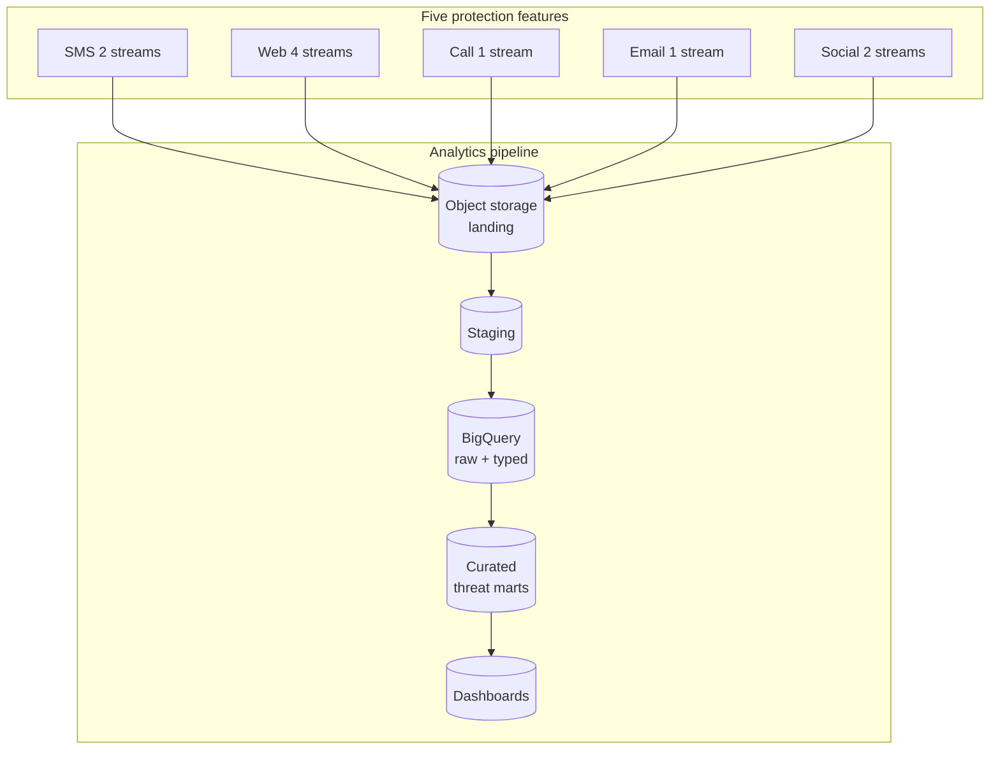
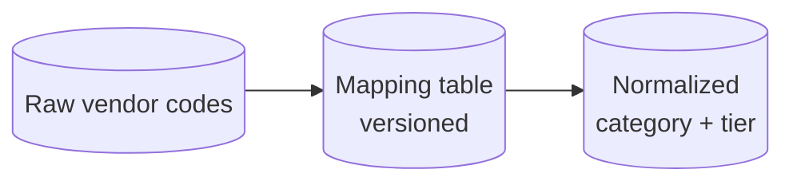

# Unified Threat Protection Analytics Across Five Consumer Security Features

## Executive summary

At a global cybersecurity company, I built a **unified analytics framework** spanning five distinct threat-protection capabilities that previously reported through isolated telemetry. Product and security leadership could not answer simple cross-cutting questions: which protection surface drove the most user-visible value, where threats were spiking, or whether investments were balanced across channels. I normalized **eighteen or more telemetry streams**, defined a shared **threat analytics taxonomy**, and delivered curated datasets and executive dashboards — including **daily threat monitoring** used by the CTO organization.

---

## The problem: excellence in silos

The organization shipped five major consumer protection features:

1. **SMS scanning** — message-level inspection and classification.
2. **Web protection** — URL reputation, blocking, and safe-browsing style events.
3. **Call blocking** — telephony abuse and spam interception signals.
4. **Email scanning** — classification of suspicious or malicious mail flows.
5. **Social media scam detection** — events tied to fraudulent or deceptive social interactions.

Each feature had grown its own instrumentation style, field naming, and release cadence. **No unified view** existed at the warehouse layer. Security operations and product teams relied on ad hoc exports and disconnected charts.

My goal was not to merge products — it was to merge **analytics semantics** so leadership could reason about the portfolio.

---

## Scale of telemetry

Across the five features I integrated **more than eighteen telemetry streams** into one framework. The **feature-by-feature stream layout** I standardized on:

| Feature | Streams (count) | Role of each stream (generalized) |
|---------|-----------------|-----------------------------------|
| SMS protection | **2** | Inbound scan volume + outcome disposition |
| Web protection | **4** | Navigation events, block decisions, reputation lookups, error / timeout telemetry |
| Call blocking | **1** | Consolidated call-screening and block outcome stream |
| Email scanning | **1** | Message classification and policy outcome |
| Social scam detection | **2** | Detection event + user feedback / escalation |

The exact vendor and schema names varied; the win was a **canonical mapping** from source streams to a small set of curated fact tables.

---

## Target architecture

I aligned all sources on the same **batch analytics path** the organization already operated for other security products: object storage landing, cross-cloud staging, warehouse load, curated marts, and BI.

**ASCII overview:**

```
┌──────────────────────────────────────────────────────────────────────────────┐
│  SOURCE LANDING (per feature teams)                                           │
│  SMS(2) + Web(4) + Call(1) + Email(1) + Social(2)  -->  dated object prefixes │
└──────────────────────────────────────────────────────────────────────────────┘
                                        │
                                        ▼
┌──────────────────────────────────────────────────────────────────────────────┐
│  STAGING / LANDING (analytics cloud)                                          │
│  Partitioned by event_date, region, feature_family                            │
└──────────────────────────────────────────────────────────────────────────────┘
                                        │
                                        ▼
┌──────────────────────────────────────────────────────────────────────────────┐
│  WAREHOUSE — RAW + TYPED                                                       │
│  Schema enforcement, dedupe keys, late-arrival windows                         │
└──────────────────────────────────────────────────────────────────────────────┘
                                        │
                                        ▼
┌──────────────────────────────────────────────────────────────────────────────┐
│  CURATED LAYER                                                                 │
│  threat_event_fact  |  protection_feature_dim  |  threat_category_dim         │
│  daily_rollups by brand / region / feature                                     │
└──────────────────────────────────────────────────────────────────────────────┘
                                        │
                                        ▼
┌──────────────────────────────────────────────────────────────────────────────┐
│  CONSUMPTION                                                                   │
│  Executive dashboards  |  SecOps monitoring  |  Product deep dives             │
└──────────────────────────────────────────────────────────────────────────────┘
```



---

## Metrics I standardized

I defined portfolio-level metrics so product and security could compare apples to apples where comparison was meaningful:

- **Messages scanned** (SMS) — volume, outcomes, and policy hits rolled to daily grain.
- **URLs blocked or warned** (Web) — separate tallies for hard block versus soft warning when both existed.
- **Calls blocked or flagged** (Call) — user-visible interventions versus silent scoring, documented per platform limits.
- **Email classifications** (Email) — malicious, suspicious, spam-like buckets with explicit handling of “unknown.”
- **Social scam events** (Social) — detections, user reports where available, and downstream actions.

Each metric carried **feature metadata** so dashboards could drill from portfolio totals to a single capability without rewriting SQL.

---

## Retention: PII versus curated analytics

I applied the same principle I use in other high-sensitivity consumer programs:

- **Raw events** that could contain message fragments, numbers, or other identifiers: **30-day PII-aligned retention** in the raw zone, with access restricted and audited.
- **Curated analytics** — counts, rates, coarse geography, categorical threat labels without payloads: **long-term** storage for trending and executive reporting.

This balance satisfied security incident needs for recent forensics while preserving multi-quarter product analytics.

---

## The threat analytics taxonomy

The hardest technical challenge was **semantic normalization**. One team’s “blocked” was another’s “warned.” One stream used vendor-specific threat codes; another used free-text labels.

I built a **threat analytics taxonomy** with three layers:

1. **Source codes** — preserved as columns for engineering debuggability.
2. **Normalized category** — a controlled vocabulary (e.g., phishing, malware distribution, scam / social engineering, spam / nuisance) agreed with security research leads.
3. **Severity tier** — coarse buckets for executive views (critical / high / medium / low / informational) with documented mapping rules.



Versioning the mapping table let us **replay history** when taxonomy changed instead of silently rewriting past numbers.

---

## Impact

- **First cross-feature visibility** into how the protection portfolio behaved in the wild, not just in siloed feature reviews.
- **Daily threat monitoring dashboards** adopted by the **CTO** organization for operational awareness — a milestone for data trust in security telemetry.
- Product teams could justify roadmap tradeoffs with **shared numbers** instead of dueling spreadsheets.

### Cultural shift

Feature teams initially worried a unified framework would “flatten” nuance. I addressed that by **preserving raw detail in restricted zones** while publishing **opinionated rollups** for broad consumption. Researchers kept depth; executives got clarity.

---

## Lessons learned

1. **Normalizing diverse telemetry schemas is a negotiation, not a script.** The taxonomy meetings were as important as the ETL jobs.

2. **Build the threat analytics taxonomy before the tenth dashboard.** Without it, every chart reinvents categories and every refresh sparks debate.

3. **Name events for the question they answer.** “scan_completed” is better than “event_type_17” when three teams need to align.

4. **Test late-arrival behavior per feature.** SMS and web traffic have different delivery skew; one-size-fits-all cutoffs create silent data loss.

5. **Document platform limitations.** Some surfaces cannot expose full metadata; dashboards should say “not available on platform X” instead of implying zero risk.

---

## Operating model

I established:

- **Weekly pipeline health review** with on-call rotation for ingestion failures.
- **Monthly taxonomy council** — short meeting to approve mapping changes when new threat types appeared.
- **Change log** for curated marts visible to both engineering and analytics.

### Stakeholder cadence

I ran a **biweekly analytics sync** with feature PMs and a **monthly portfolio review** with security leadership. The first forum caught instrumentation gaps before they skewed trends; the second connected product investment to observable threat pressure. Keeping both rhythms prevented the curated layer from drifting into either pure engineering debug or pure marketing narrative.

### Questions the unified framework finally answered

- Which protection surface contributed the largest share of **user-visible interventions** in a given week?
- Where were **spikes** correlated across features (suggesting campaign-driven malware or regional telecom abuse patterns)?
- Did new releases **regress** scan volume or block quality on any platform?

These were straightforward questions that had been expensive before normalization.

---

## Tech stack (generalized)

**AWS S3**-compatible landing, staging compatible with **GCS**, **BigQuery** as the analytical warehouse, organizational standard orchestration, and BI tools on curated marts.

---

## What I would reinforce next time

- Earlier **contract testing** on sample payloads from each feature before production cutover.
- A single **internal glossary** linked from every dashboard footnote.
- **Synthetic event injection** in lower environments to validate mapping rules before real traffic spikes.

---

## Closing

This work turned a collection of strong but disconnected protections into a **portfolio story** leadership could monitor daily. I am proud of the balance between security nuance and executive readability — and of the taxonomy discipline that made the numbers defensible quarter after quarter.
