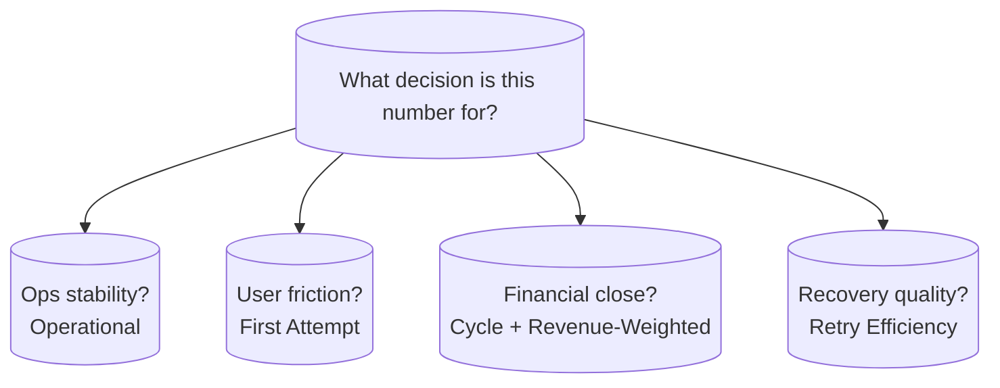
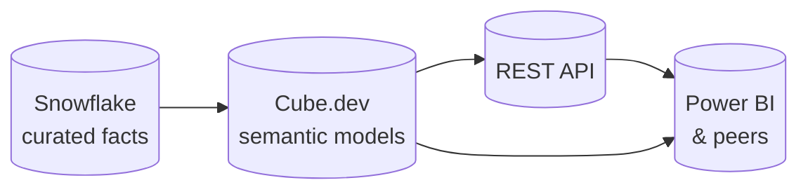

# Governing a Mission-Critical Billing Health Metric Across Brands and Functions

## Executive summary

A subscription-based software company relied on a **single billing health metric** that implicitly governed **multi-billion dollar renewal revenue** across **five consumer brands**. Finance, Payments, and Product each produced **a different number** for “the same” concept. Power BI reports slowed as teams pushed more logic through **XMLA**-heavy patterns. There was **no semantic layer** — business rules lived in scattered **DAX**, **SQL**, and **Excel**. I led the **metric taxonomy and target architecture** design: a **six-variant framework**, **denominator governance**, and a path to **Snowflake → Cube.dev semantic layer → REST API → BI tools** so the organization could finally agree on **one definition per decision type** and retire the “which number is right?” debates.

---

## The metric confusion problem

Three major functions — **Finance**, **Payments**, and **Product** — each calculated billing health using locally convenient data sources and slightly different inclusion rules.

| Symptom | What I observed |
|--------|------------------|
| Three teams, three numbers | Leadership meetings opened with reconciliation, not decisions |
| Drift over time | Each team “fixed” edge cases in their own tool without broadcasting the rule change |
| Low trust in self-serve | Analysts re-derived metrics in notebooks because they did not believe dashboards |
| Performance pain | Heavy semantic logic in client tools stressed refresh times and concurrency |

The metric was not technically ambiguous — it was **politically and operationally unconstrained**. My job was to make the math **explicit**, the variants **named**, and the **denominators** impossible to confuse.

---

## Power BI and XMLA strain

The organization had invested deeply in **Power BI**. Over time, datasets grew complex and teams relied increasingly on **XMLA** endpoints and advanced modeling features to patch gaps. Refresh times stretched, and concurrent user load exposed bottlenecks.

I treated this as a **symptom**, not the root cause: **business logic had no home**. DAX became a dumping ground for rules that belonged in a governed warehouse or semantic layer.

---

## No semantic layer — until we designed one

Before my architecture work, equivalent SQL fragments lived in:

- Finance reconciliation models
- Payments pipeline validation queries
- Product funnel analyses
- One-off executive Excel workbooks

There was no **single compiled definition** exposed to tools. I proposed moving **authoritative logic upstream** into a **semantic layer** with an API surface so BI tools became **thin clients**.

---

## My solution: six-variant metric taxonomy

I designed a **six-variant taxonomy** so each stakeholder could find “their” number without pretending all questions were identical:

| Variant | Intent | Typical consumer |
|---------|--------|------------------|
| **Operational** | Raw operational throughput — what the billing systems attempted | Engineering / ops |
| **Clean** | Successful completions after removing known noise / test traffic | Product analytics |
| **First Attempt** | Outcomes on initial try without counting recovery paths | Customer experience teams |
| **Cycle** | Behavior within a defined billing cycle window | Finance (accrual-aligned views) |
| **Revenue-Weighted** | Health weighted by subscription value or segment | FP&A, exec reviews |
| **Retry Efficiency** | Recovery success after failure — quality of remediation | Payments / risk |

Naming the variants ended half the arguments. The other half required **denominator governance**.

---

## Denominator governance framework

For each variant I documented:

1. **Population** — which subscriptions, brands, and regions are in scope.
2. **Time boundary** — calendar date versus billing cycle versus attempt timestamp.
3. **Inclusion rules** — retries, chargebacks, pauses, grace periods.
4. **Exclusion rules** — internal accounts, fraud holds, partner test tenants.
5. **Grain** — per attempt, per subscription-day, per invoice, per cycle.

I published a **decision tree**: “If you are answering question X, use variant Y at grain Z.” That single artifact did more for alignment than months of ad hoc meetings.



---

## Target architecture

```
┌─────────────────────────────────────────────────────────────────────────────┐
│  SNOWFLAKE                                                                   │
│  Curated billing facts + reference dims (single governed source)             │
└─────────────────────────────────────────────────────────────────────────────┘
                                      │
                                      ▼
┌─────────────────────────────────────────────────────────────────────────────┐
│  SEMANTIC LAYER (Cube.dev)                                                   │
│  Six published measures + shared dimensions + API                            │
└─────────────────────────────────────────────────────────────────────────────┘
                                      │
                    ┌─────────────────┴─────────────────┐
                    ▼                                   ▼
┌──────────────────────────────┐         ┌──────────────────────────────┐
│  REST / GraphQL API          │         │  Embedded semantic SQL         │
│  (metrics for apps & tools)  │         │  (approved downstream patterns) │
└──────────────────────────────┘         └──────────────────────────────┘
                    │                                   │
                    └─────────────────┬─────────────────┘
                                      ▼
┌─────────────────────────────────────────────────────────────────────────────┐
│  BI TOOLS (Power BI, others)                                                 │
│  Thin models — consume pre-defined measures                                   │
└─────────────────────────────────────────────────────────────────────────────┘
```



---

## Generic Cube.dev model example (illustrative)

Below is a **fictional, generic** Cube schema fragment showing how I would express governed measures without binding to proprietary table names. Real implementations referenced the organization’s curated fact and dimension names.

```yaml
cubes:
  - name: billing_attempts
    sql_table: analytics_curated.fct_billing_attempt

    dimensions:
      - name: attempt_id
        sql: attempt_id
        type: string
        primary_key: true

      - name: brand_code
        sql: brand_code
        type: string

      - name: attempt_at
        sql: attempt_at
        type: time

      - name: is_first_attempt
        sql: is_first_attempt
        type: boolean

    measures:
      - name: operational_attempts
        type: count
        title: Operational Attempts

      - name: clean_successes
        type: count
        filters:
          - sql: "{CUBE}.status = 'SUCCESS' AND {CUBE}.is_noise = FALSE"

      - name: first_attempt_successes
        type: count
        filters:
          - sql: "{CUBE}.status = 'SUCCESS' AND {CUBE}.is_first_attempt = TRUE"

      - name: retry_recoveries
        type: count
        filters:
          - sql: "{CUBE}.recovery_outcome = 'SUCCESS'"

      - name: revenue_weighted_health
        type: sum
        sql: "CASE WHEN {CUBE}.status = 'SUCCESS' THEN {CUBE}.contract_value ELSE 0 END"
```

The point of the YAML is not syntax trivia — it is **co-location of logic**, **reviewability in Git**, and **one API** for every consumer.

---

## Rollout strategy I advocated

1. **Shadow period** — run new semantic measures parallel to legacy reports; log variance.
2. **Executive sign-off** per variant — especially Revenue-Weighted and Cycle.
3. **Deprecate DAX clones** — after parity, remove duplicate definitions from datasets.
4. **Performance budget** — API p95 targets so dashboards stayed snappy without XMLA gymnastics.

---

## Impact

- **Eliminated persistent “which number is right?” debates** by naming variants and publishing denominators.
- **Unified metric definitions** across Finance, Payments, and Product for the core billing health family.
- **Set a credible path** off fragmented spreadsheet logic toward **API-first metrics**.

---

## Lessons learned

1. **Metrics are political.** The hardest part was **getting agreement**, not writing SQL. I spent more time in workshops with FP&A and Payments than in the warehouse editor.

2. **Variants beat false precision.** Pretending one KPI answers every question guarantees distrust. Six named variants felt like more work up front and saved quarters later.

3. **Denominators are where stealth bugs live.** I now start metric design from the denominator backward.

4. **Semantic layers need owners.** Technology without a **stewardship model** becomes a fancier silo. I paired each variant with a named business owner.

5. **BI performance follows logic placement.** Moving measures upstream fixed more refresh pain than incremental DAX tuning.

---

## What I would add in a greenfield program

- **Metric RFC template** — one page per new measure: definition, owner, refresh SLA, known limitations.
- **Automated contract tests** between Snowflake aggregates and Cube-exposed measures.
- **Lineage visualization** from raw ingest to API field for auditors.

---

## Closing

This engagement sharpened my belief that **data platforms succeed when semantics are negotiable in the open and immutable in production.** I designed the taxonomy and architecture that made that possible for one of the most sensitive numbers in the company — and I would bring the same discipline to any organization where **trust is revenue-critical**.
