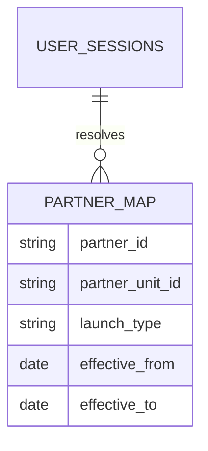
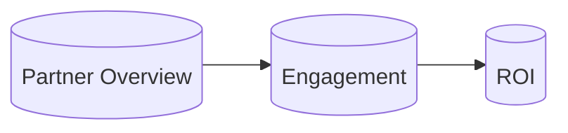
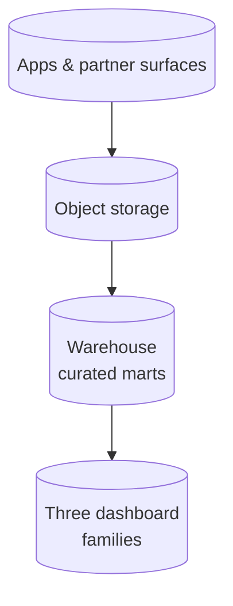

# Partner Distribution Analytics for AI and Security Products

## Executive summary

The company distributed AI and security offerings through **partner channels** - including telecom carriers and device OEMs - alongside direct-to-consumer acquisition. A **lightweight free tier** was introduced for partner bundles to drive scale. **No analytics existed** for partner performance: leadership could not compare partner cohorts, measure engagement quality, or build an ROI narrative for renewal conversations. I designed **tracking dimensions**, **SQL segmentation logic** for acquisition channels, a **metric suite**, **three dashboard families**, and an end-to-end pipeline from landing data to executive-ready views. The outcome was **first-ever partner ROI reporting** and a **data-driven partner strategy** for the next fiscal cycle.

---

## The gap

Partner deals were negotiated on trust and qualitative feedback. Finance saw revenue; product saw aggregate MAU; partner managers saw anecdotes. When the lightweight tier launched, the blind spot grew: **high volume, low direct monetization**, and **messy attribution** across OEM preload, carrier billing, and promotional campaigns.

I was brought in to make partner performance **measurable, comparable, and actionable**.

---

## Partner tracking dimensions

I specified core dimensions that had to appear (or be derivable) in curated analytics:

| Dimension | Purpose |
|-----------|---------|
| `partner_id` | Stable identifier for the commercial partner entity |
| `partner_unit_id` | Sub-entity when one partner runs multiple programs or regions |
| `launch_type` | Distinguishes campaign, preload, upgrade path, seasonal promo, etc. |
| `brand` | Consumer-facing product line within the portfolio |

These fields were not always clean in source telemetry. I built **mapping tables** maintained by partner operations with effective dating so historical reporting stayed consistent when a partner reorganized internal IDs.



---

## SQL segmentation logic for acquisition channels

A recurring analytics need was to segment users by **how they arrived** and **whether they carried subscription entitlement**. I implemented **explicit CASE logic** in the curated layer (conceptual pattern below - table names are illustrative only):

```sql
-- Illustrative segmentation: partner / free vs partner / subscriber vs direct
SELECT
  user_sk,
  activity_date,
  partner_id,
  partner_unit_id,
  launch_type,
  brand,
  CASE
    WHEN partner_id IS NOT NULL
         AND subscription_tier = 'LIGHTWEIGHT_FREE'
      THEN 'partner_free_tier'
    WHEN partner_id IS NOT NULL
         AND subscription_tier IN ('PAID', 'PREMIUM', 'BUNDLE_PAID')
      THEN 'partner_subscriber'
    WHEN partner_id IS NULL
      THEN 'direct_acquisition'
    ELSE 'other_or_unclassified'
  END AS acquisition_channel_segment
FROM curated_user_daily_activity;
```

**Design choices I enforced:**

- **NULL partner** does not automatically mean direct - some builds omit partner metadata; I routed unknowns to `other_or_unclassified` until mapping improved.
- **Tier enums** were aligned with billing reference data, not marketing labels that changed quarterly.
- **One row per user per day** at the curated grain to prevent double-counting in dashboards.

---

## Metrics I defined

I built a concise metric suite that partner managers and finance could interpret without a data science degree:

| Metric | Definition (high level) |
|--------|-------------------------|
| **Partner active users** | Distinct users with meaningful product activity in period, attributed via partner dimensions |
| **Lightweight adoption rate** | Share of partner-attributed installs or activations that engaged with the free tier within a defined window |
| **Conversion rate** | Movement from lightweight free to paid or bundled paid states, with explicit lag windows |
| **Engagement score** | Composite of session frequency, depth of feature use, and retention flags - tuned to avoid gaming by raw click volume |
| **Partner scam / threat signal rate** | Incidence of relevant security events per active user for partners where product value is protection - expressed as a rate, not raw counts, for privacy scale |

Each metric had a **footnote block** in the dashboard: population, window, and known exclusions.

---

## Three dashboard families

I delivered **three dashboards** aimed at different decision speeds:

### 1. Partner Overview

- Portfolio ranking of partners by active users and revenue-attributed cohorts where available.
- Launch-type breakdown to show whether preload or campaign drove spikes.
- Brand split for multi-brand portfolios.

### 2. Engagement

- Lightweight tier depth: activation funnel, feature adoption, return usage.
- Cohort curves for partner vs direct (where sample sizes support them).
- Engagement score distribution to spot “ghost installs.”

### 3. ROI

- Partner-level cost inputs (where finance provided them) against active and converting users.
- Simple payback framing suitable for executive slides - **directionally accurate**, not pretending precision the data could not support.
- Scenario filters for fiscal quarters to align with planning cycles.



---

## Architecture

Partner telemetry followed the same enterprise pattern as other product analytics: land in object storage, stage in the analytics cloud, load to the warehouse, curate, visualize.

**ASCII pipeline:**

```
┌─────────────────────────────────────────────────────────────────────────────┐
│  CLIENT / APP / PARTNER GATEWAYS                                            │
│  Events with partner_id, partner_unit_id, launch_type (when instrumented)    │
└─────────────────────────────────────────────────────────────────────────────┘
                                      │
                                      ▼
┌─────────────────────────────────────────────────────────────────────────────┐
│  OBJECT STORAGE - LANDING                                                     │
│  Daily partitions, schema validation, quarantine path for malformed batches   │
└─────────────────────────────────────────────────────────────────────────────┘
                                      │
                                      ▼
┌─────────────────────────────────────────────────────────────────────────────┐
│  STAGING → WAREHOUSE                                                         │
│  Typed tables, dedupe, late-arrival handling                                  │
└─────────────────────────────────────────────────────────────────────────────┘
                                      │
                                      ▼
┌─────────────────────────────────────────────────────────────────────────────┐
│  CURATED MARTS                                                               │
│  user_daily_activity, partner_dim, subscription_bridge, engagement_features  │
└─────────────────────────────────────────────────────────────────────────────┘
                                      │
                                      ▼
┌─────────────────────────────────────────────────────────────────────────────┐
│  DASHBOARDS - Overview | Engagement | ROI                                    │
└─────────────────────────────────────────────────────────────────────────────┘
```



---

## Data quality realities

Partner data is inherently **messy**. I invested in:

- **Effective-dated mappings** when partners changed IDs or consolidated programs.
- **Unknown bucket transparency** - dashboards showed “unattributed” percentages instead of hiding gaps.
- **Reconciliation hooks** with finance for subscriber bridges so conversion metrics did not contradict billing.

---

## Impact

- **First-ever partner ROI reporting** suitable for executive and board-adjacent conversations (with honest confidence bands).
- **Data-driven partner strategy** for the next fiscal year - which programs to expand, which to renegotiate, and where lightweight tier friction blocked conversion.
- **Shared vocabulary** between product, finance, and partner sales - a prerequisite for any sophisticated co-marketing analytics.

---

## Lessons learned

1. **Partner data is messy; plan for mapping tables as a first-class product**, not an afterthought.

2. **Attribution requires clear definitions upfront.** I should have locked segmentation rules before the first dashboard screenshot circulated - retroactive relabeling always costs political capital.

3. **Lightweight tiers need their own success metrics.** Volume without engagement misleads both sides of a partnership.

4. **ROI dashboards need humility.** When cost inputs are partial, say so; otherwise finance will reject the entire program.

5. **Engagement scores must be defensible.** I favored interpretable components over opaque ML scores so partners could understand “why” when challenged.

---

## Tech stack (generalized)

Object storage landing, cloud data warehouse (organization-standard), BI tooling for the three dashboard families, and Git-reviewed SQL for curated marts.

---

## What I would standardize earlier next time

- **Partner instrumentation checklist** in every distribution contract appendix.
- **Synthetic end-to-end test devices** per partner SKU to validate event completeness before launch.
- **Quarterly data quality scorecard** shared externally to top partners (aggregated) to align incentives.

---

## Closing

I built the analytics foundation that turned partner distribution from a **narrative business** into a **measurable channel**. The combination of strict segmentation logic, honest handling of messy IDs, and three dashboard layers gave the organization something it had never had: **credible partner ROI** and a path to improve it.
