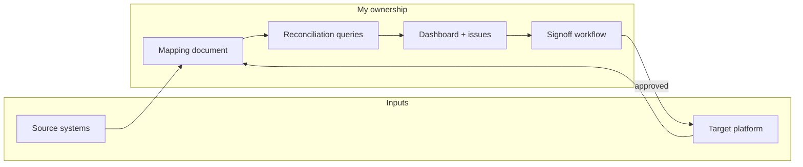
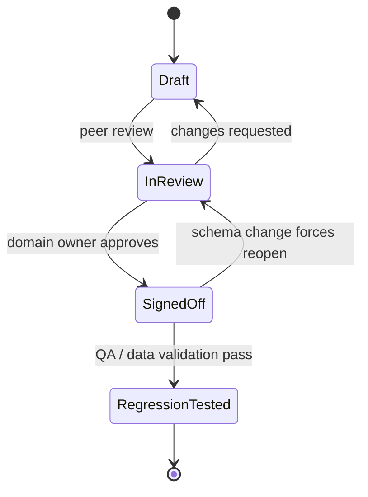

# Platform Migration & Field Reconciliation

**Role:** Data engineering lead (mapping, reconciliation, quality)  
**Context:** A global software company consolidating two major subscription management platforms into one unified licensing system, with millions of customer records to migrate.

---

## Executive summary

I owned the centralized data field mapping and reconciliation for a multi-year platform consolidation. Across five business domains, I mapped **190+ fields** from legacy sources through target schemas into executable migration logic. I built the governance artifacts—living mapping documentation, automated reconciliation, a reconciliation dashboard, and a multi-team signoff workflow—so that quality issues were visible, attributable, and closed before cutover.

---

## The problem

Two platforms had evolved independently for years. Semantics diverged: the same “customer” concept split across accounts, devices, orders, and entitlements. Dates, statuses, and identifiers did not align one-to-one. Without a single source of truth for “what this field means here vs there,” engineering teams would have shipped inconsistent migrations and discovered defects only after customers were affected.

---

## Scope: five data domains

| Domain | Approx. fields mapped | Primary concern |
|--------|----------------------|-----------------|
| License | 40+ | Entitlement semantics, effective dates, seat logic |
| Device | 15 | Identifier stability, association to accounts |
| Account | 27 | Identity resolution, contact data, delegate relationships |
| Order | 55+ | Status enums, partial states, refunds and renewals |
| Product / SKU | 53 | Catalog translation, bundle vs component mapping |

**Total:** 190+ fields traced **source → target → migration rule**, with explicit handling for nulls, defaults, and edge cases.

---

## Key challenges by domain

### License
- **No one-to-one date mapping:** Effective start, end, grace periods, and trial windows did not share the same calendar semantics between systems. I documented every transformation (timezone normalization, inclusive vs exclusive bounds, “end of day” rules).

### Account
- **Missing emails and weak identifiers:** A meaningful share of records lacked primary contact channels or had unstable keys. I defined **account association logic** to resolve null or ambiguous identifiers using conservative join paths and explicit fallbacks—never guessing beyond what the business approved.

### Order
- **Complex order status enums:** Dozens of legacy states had to collapse into a smaller target taxonomy without losing legal or financial meaning. I maintained a decision matrix and escalation path for ambiguous rows.

### Product / SKU
- **SKU translation gaps:** Not every source SKU had a target equivalent. I paired **SKU mapping validation** with exception queues so gaps were visible before batch loads, not after.

### Cross-cutting
- **Seat counts:** With a large catalog (on the order of tens of thousands of SKUs), **seat count validation** surfaced mismatches between entitlement math and catalog expectations. A small subset was flagged as urgent for business review; the rest flowed into structured remediation.

---

## Architecture: simple, deliberate, scalable

The design was intentionally boring in the right way: **one authoritative mapping artifact**, **repeatable reconciliation SQL**, and **a thin dashboard** for humans to act on exceptions.

```
┌─────────────────────────────────────────────────────────────────────────┐
│                    CENTRAL MAPPING DOCUMENT                              │
│  (field lineage, transforms, owners, status, revision history)           │
└───────────────────────────────┬─────────────────────────────────────────┘
                                │
        ┌───────────────────────┼───────────────────────┐
        ▼                       ▼                       ▼
┌───────────────┐     ┌─────────────────┐     ┌──────────────────┐
│ Source        │     │ Target          │     │ Migration        │
│ extracts      │     │ schema registry │     │ rule engine /    │
│ (staging)     │     │ (contracts)     │     │ ETL jobs         │
└───────┬───────┘     └────────┬────────┘     └────────┬─────────┘
        │                      │                       │
        └──────────────────────┼───────────────────────┘
                               ▼
                 ┌─────────────────────────────┐
                 │ AUTOMATED RECONCILIATION     │
                 │ (joins, counts, diffs,       │
                 │  domain-specific validators) │
                 └─────────────┬───────────────┘
                               ▼
                 ┌─────────────────────────────┐
                 │ RECONCILIATION DASHBOARD     │
                 │ + quality issue tracker      │
                 │ + signoff workflow           │
                 └─────────────────────────────┘
```

### Mermaid: governance and data flow



---

## Reconciliation patterns I built

1. **Account association logic**  
   Resolved null or inconsistent identifiers using approved lookup paths and explicit “no match” buckets so we never silently merged unrelated parties.

2. **Delegate account logic**  
   Handled secondary and delegated relationships where the “billable” party differed from the “using” party, with rules documented per jurisdiction and product line where needed.

3. **SKU mapping validation**  
   Cross-checked every migrated line item against the approved SKU dictionary; unknowns blocked promotion to the next environment until mapped or explicitly waived.

4. **Seat count validation**  
   Compared entitlement seats to catalog and contract expectations across the full SKU universe; surfaced a prioritized queue (including a small set marked urgent for immediate business action).

5. **Date field validation**  
   Asserted ordering invariants (start ≤ end), non-null requirements where the business mandated them, and consistency between related entities (e.g., order dates vs license effective dates).

---

## My role in delivery

- **Centralized mapping document:** I maintained the living specification through **136+ revisions** as schemas, business rules, and cutover plans changed. Each field carried source definition, target definition, transform, owner, and validation status.
- **Validation status tracking:** Every field and rule had a lifecycle (draft → reviewed → signed off → regression-tested), visible to all stakeholders.
- **Reconciliation dashboard:** I surfaced exception counts, aging, and ownership so leadership could see migration health at a glance.
- **Multi-team signoff workflow:** Data, product, finance, and engineering each had explicit approval gates for domains they owned—reducing “we thought someone else checked that” failures.
- **Quality issue tracking:** Exceptions were tickets with severity, reproduction queries, and closure criteria—turning migration into a measurable quality program.

---

## Impact

- **190+ fields** mapped with traceable lineage and testable rules.  
- **Five domains** covered end-to-end from extract through reconciliation.  
- **Quality issues** were tracked to resolution instead of accumulating as hidden debt.  
- The organization could rehearse cutover with confidence because exceptions were enumerated, not imagined.

---

## Lessons learned

1. **Migration is roughly 80% data mapping and 20% engineering.** The hard problems are semantic: what a field *means*, who decides, and how you prove correctness.  
2. **Centralized documentation prevents chaos.** When every team maintains its own spreadsheet, contradictions become inevitable. One governed artifact, versioned and reviewed, scales better than heroics.  
3. **Reconciliation must be boring and exhaustive.** Flashy ETL is useless if you cannot explain, row by row, why a customer looks the way they do in the target system.

---

## Technologies & patterns (generalized)

- Staging layers in the warehouse / lakehouse for side-by-side compares  
- SQL-first reconciliation (counts, diffs, anti-joins, windowed checks)  
- Dashboarding for operational visibility  
- Workflow tooling for approvals and audit trail  

---

## What I would do again

I would invest even earlier in **automated regression** tied to the mapping document—so every schema or rule change re-ran a standard battery of reconciliation tests before humans spent time in meetings.

---

## Stakeholders and operating cadence

I treated the mapping document as a **shared contract**, not a private notebook. Core participants included:

- **Engineering** — implementation of transforms, performance of bulk loads, environment promotion.  
- **Product** — entitlement semantics, trial behavior, device limits, and customer-visible states.  
- **Finance / order-to-cash** — revenue recognition adjacency, refund and chargeback flows.  
- **Data platform** — staging standards, warehouse contracts, and reconciliation job scheduling.

We ran a **weekly migration health review** driven by dashboard metrics: open exceptions, aging buckets, and signoff coverage by domain. When a domain stalled, we did not debate intuition—we opened the mapping row and asked: *what is the approved rule, who owns the decision, and what query proves it?*

---

## Cutover rehearsal and regression mindset

Before any major environment promotion, I insisted on **rehearsal runs** that mirrored production volume class (often sampled or masked, but structurally identical). Reconciliation queries became **regression tests**: if yesterday’s exception count was *N* and today’s is *10N* without an explained rule change, we stopped the line.

This discipline turned “we fixed it in the spreadsheet” into “we fixed it in version **137** of the document **and** the reconciliation suite moved accordingly.”

---

## SKU and seat work at scale (generalized outcomes)

The product catalog spanned **tens of thousands of SKUs**. Seat validation compared **entitlement math** to **catalog expectations** and flagged mismatches for human triage. A **small fraction** was classified as **urgent** (ambiguous bundles, conflicting pack sizes, or known catalog cleanup in flight); the remainder followed a **standard remediation queue** with clear owners.

I avoided one-off SQL patches for individual SKUs wherever possible—every recurring pattern became a **documented rule** or a **dictionary table** maintained by product operations.

---

## Questions the mapping document had to answer

Every serious migration generates the same categories of question. I designed the artifact so each had a home:

| Question | Where it lived |
|----------|----------------|
| What does this source column mean in practice? | Source definition + examples |
| What is the target column’s type and nullability? | Target schema registry link |
| How do we transform values? | Transform formula / lookup / default |
| What happens for unknowns? | Exception path + waiver workflow |
| Who approved this? | Signoff history + date |
| How do we test it? | Linked reconciliation query ID |

---

## Signoff lifecycle (Mermaid)



---

## Metrics I tracked (qualitative / directional)

I did not optimize for vanity counts; I tracked **signals that predicted cutover risk**:

- **Exception trend** — are we converging week over week?  
- **Signoff coverage** — are all high-risk fields past regression?  
- **Aging** — which exceptions have sat without an owner?  
- **Repeat offenders** — which transforms keep breaking under new source drops?

These metrics were **directional**—the goal was a **downward slope** in unexplained variance, not a single headline number.

---

## Reflection

This program reminded me that **enterprise migrations are sociology as much as technology**. The mapping document was the **institutional memory** that kept distributed experts aligned. My proudest outcome was not a clever join—it was the moment product and engineering both pointed to the **same row** during a disagreement and resolved it in minutes instead of days.

---

*This case study describes real work using generalized terminology to protect confidentiality.*
