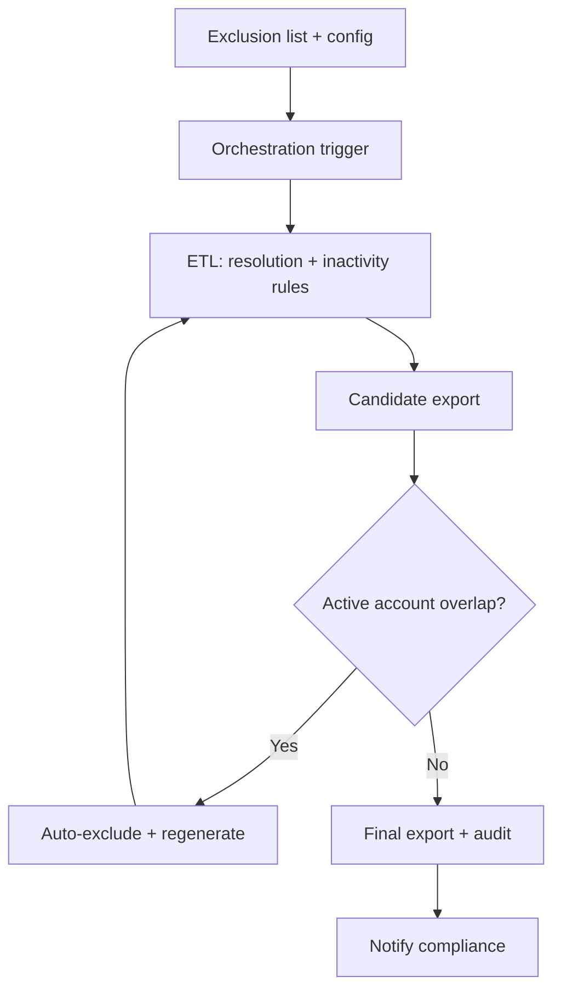

# Privacy-Regulated Inactive-Account ETL

**Role:** Data engineer (design, implementation, validation)  
**Context:** Under U.S. privacy regulation aligned with **CCPA/CPRA-style** requirements, the organization needed to **identify and export** customer accounts that met strict **inactivity** criteria so that regulated **data deletion** processes could proceed safely and audibly.

---

## Executive summary

I designed and implemented **two complementary export pipelines**—one for accounts with **expired, inactive subscriptions**, and one for accounts with **zero subscriptions**—plus a **paranoid validation framework** that refused to ship if **any** still-active account appeared in an export. The result was a **fully automated, validated** compliance workflow: orchestration, generation, validation, exclusion handling, and notification to the compliance function—with **no leakage of active accounts** into deletion-bound datasets.

---

## Regulatory and business constraints

- **Inactivity** had to be defined consistently with legal interpretation and product reality—not merely “no login in 30 days.”  
- A **36-month inactivity filter** anchored the eligibility window alongside subscription state.  
- Certain **product lines** (e.g., free-tier, partner-managed, legacy bundles) required **explicit exclusion** from automated eligibility.  
- **False positives**—marking an active subscriber or payer for deletion—were unacceptable; the validation philosophy was **conservative by default**.

---

## Two export pipelines

### Pipeline A: Inactive accounts with expired subscriptions

Eligible accounts had subscriptions that were **inactive** under business rules, with **expiration** and **non-renewal** semantics applied consistently across product families.

### Pipeline B: Accounts with zero subscriptions

Eligible accounts had **no** subscription rows in the entitlement system after association and delegate resolution—still subject to the same inactivity and exclusion rules.

Both pipelines shared **core resolution logic** so that identity and product attachment were interpreted identically regardless of subscription cardinality.

---

## ETL business logic (core building blocks)

1. **Account association resolution**  
   Where primary identifiers were null or fragmented, I used **approved lookup tables** and join paths to attach activity and subscription facts to a single account spine—without inventing identities.

2. **Delegate account resolution**  
   Where a payer, admin, or family delegate differed from the end user, I applied **role-aware rules** so subscription and activity signals attached to the correct legal entity for deletion eligibility.

3. **Role-based product association**  
   Product entitlements were attributed through roles (owner, member, beneficiary patterns—generalized here) so that “has a subscription” reflected real access, not a stray orphan row.

4. **Inactive subscription calculation**  
   I used **window functions** to order subscription history, detect last active periods, and evaluate state transitions (active → lapsed → expired) in a deterministic way across overlapping rows.

5. **36-month inactivity filter**  
   Combined last meaningful activity signals with subscription state so that short-term churn or seasonal use did not accidentally qualify or disqualify accounts without review.

---

## Validation framework: “trust but verify” is not enough

**Compliance ETL requires paranoid validation.**

1. **Load the authoritative set of active accounts** (as defined by finance, product, and legal—e.g., currently billable or entitled).  
2. **Cross-validate** the export candidate list against that set.  
3. If **any** intersection exists → **validation failed** → **auto-exclude** those accounts → **regenerate** the export.  
4. Only after a clean run does the pipeline emit the final artifact and notify stakeholders.

This turned “we think it’s right” into a **machine-enforced invariant**.

```
┌──────────────────────────────────────────────────────────────────────────┐
│                     EXCLUSION & CONFIG INPUTS                             │
│  (product lines, partner programs, legal holds, manual overrides)         │
└───────────────────────────────┬──────────────────────────────────────────┘
                                ▼
┌──────────────────────────────────────────────────────────────────────────┐
│                     ORCHESTRATED ETL RUN                                  │
│  • Association + delegate resolution                                      │
│  • Role-based product attachment                                          │
│  • Inactivity + 36-month rules                                            │
│  • Pipeline A / B branching                                               │
└───────────────────────────────┬──────────────────────────────────────────┘
                                ▼
┌──────────────────────────────────────────────────────────────────────────┐
│                     CANDIDATE EXPORT LIST                                 │
└───────────────────────────────┬──────────────────────────────────────────┘
                                ▼
┌──────────────────────────────────────────────────────────────────────────┐
│                     VALIDATION GATE (HARD STOP)                           │
│  IF candidate ∩ active_accounts ≠ ∅  → FAIL → exclude → rebuild         │
│  ELSE → PASS                                                              │
└───────────────────────────────┬──────────────────────────────────────────┘
                                ▼
┌──────────────────────────────────────────────────────────────────────────┐
│                     FINAL EXPORT + AUDIT LOG                              │
│  → Notify compliance team (email / ticket system)                         │
└──────────────────────────────────────────────────────────────────────────┘
```

### Mermaid: end-to-end compliance flow



---

## Exclusion list handling

I implemented **first-class exclusion** inputs:

- **Free-tier** offerings that should never enter deletion eligibility without separate legal review.  
- **Partner-managed** accounts where the organization is not the system of record for consent or retention.  
- **Legacy** product lines with known data gaps, routed to manual review rather than automated export.

Exclusions were **versioned** and **logged** so every run could answer: *which rules were in effect, and why was this account excluded?*

---

## Production workflow

1. Compliance or privacy operations publishes an **exclusion list** and any **parameter updates** (e.g., cohort date).  
2. **Orchestration** triggers the job on schedule or on demand.  
3. The system **generates** candidate exports for both pipeline types where applicable.  
4. **Validation** runs; failures short-circuit to remediation, not silent partial success.  
5. On success, artifacts are **published** to the approved secure location and the **compliance team is notified** (email or workflow integration).

---

## Impact

- **Regulatory alignment:** Auditable definitions, repeatable runs, and clear artifacts for legal and privacy partners.  
- **Zero active-account leakage** in production exports under the validation contract I implemented.  
- **Full automation** with **human-in-the-loop** only where policy required—reducing manual spreadsheet risk.  
- **Operational confidence:** Fail-closed behavior meant incidents were **visible**, not subtle.

---

## Lessons learned

1. **False positives are career-ending in this domain.** I optimized for **blocking exports** over **shipping fast**.  
2. **Compliance ETL is a product:** It needs SLAs, runbooks, ownership, and versioning like any customer-facing system.  
3. **Window functions and careful joins are not “clever”—they are clarity tools** when you must explain eligibility row by row to an auditor.  
4. **The hardest meetings are semantic, not technical.** “Inactive” is a word lawyers, product managers, and engineers define differently until you write it in SQL.

---

## Representative SQL pattern (generic names)

Freshness and eligibility checks often look like ordered subscription history. A **generic** illustration of the *shape* of logic (not production code):

```sql
-- Illustrative only: rank subscription periods per account
WITH sub_ranked AS (
  SELECT
    account_id,
    subscription_id,
    status,
    effective_start,
    effective_end,
    ROW_NUMBER() OVER (
      PARTITION BY account_id
      ORDER BY effective_end DESC NULLS LAST, effective_start DESC
    ) AS recency_rank
  FROM dw_entitlement.subscription_fact
)
SELECT account_id
FROM sub_ranked
WHERE recency_rank = 1
  AND status IN ('EXPIRED', 'CANCELED', 'LAPSED')
  -- ... plus inactivity window and exclusion joins ...
;
```

---

## What I would strengthen next

I would add **synthetic negative testing** in lower environments—seeded “trap” accounts that should never qualify—to catch logic regressions before they reach production.

---

## Audit trail and defensibility

Every production run produced an **audit bundle** sufficient for privacy and legal review:

- **Parameter snapshot** — inactivity window, run timestamp, environment, and exclusion list version.  
- **Row counts** — candidates before validation, auto-excluded overlaps, final export cardinality.  
- **Hash or checksum** (where policy allowed) — to prove artifact integrity between generation and handoff.  
- **Approver identity** — who acknowledged receipt on the compliance side.

I designed logging so an auditor could reconstruct **not only what shipped**, but **what almost shipped** and **why it was blocked**.

---

## Security and handling of exports

Exports contained identifiers governed by strict policy. I partnered with security on:

- **Least-privilege** service accounts for orchestration.  
- **Encrypted** transit and at-rest storage in approved buckets or shares.  
- **Time-bounded access** — credentials scoped to the job window.  
- **No local laptops** as a system of record; artifacts lived in governed storage with access reviews.

The technical pattern is unremarkable—**which is the point**. Compliance systems should be boring and hard to misuse.

---

## Illustrative validation SQL (overlap check)

The following shows the **shape** of the active-account guardrail (generic identifiers):

```sql
-- Illustrative: fail if any export candidate is still "active"
WITH candidates AS (
  SELECT account_id FROM compliance_export.candidate_accounts_v1
),
active AS (
  SELECT account_id FROM dw_customer.account_active_authoritative_v1
)
SELECT COUNT(*) AS active_leakage_count
FROM candidates c
INNER JOIN active a ON c.account_id = a.account_id;
-- Expect 0 before promoting to final export
```

In practice, when `active_leakage_count > 0`, the pipeline **wrote those IDs to an exclusion table**, **re-ran** eligibility with the augmented exclusion, and **blocked** final publication until clean.

---

## Operational SLAs and ownership

I documented explicit **RACI** items:

- **Data engineering** — pipeline correctness, performance, and validation logic.  
- **Privacy / compliance** — interpretation of regulatory criteria and approval of exclusions.  
- **Security** — access paths and encryption posture.  
- **Product** — definitions of subscription states for edge offerings.

We aligned on **run windows** that respected downstream processing limits and **notification SLAs** so compliance teams were never left guessing whether a run succeeded.

---

## Dual-pipeline rationale (why not one job?)

A single monolithic export would have mixed **different eligibility stories** into one opaque filter. Splitting into **expired-subscription inactivity** vs **zero-subscription** paths made it possible to:

- **Explain** cohorts independently to legal reviewers.  
- **Tune** performance (different join fan-out characteristics).  
- **Test** each path with targeted synthetic fixtures.

The shared kernel—association, delegates, exclusions—prevented **semantic drift** between the two outputs.

---

## Reflection

This work reinforced a simple rule I still use: **in compliance ETL, clarity is kindness**. When every join is documented and every failure mode fails closed, you sleep better—and your partners in legal and privacy trust the machinery.

---

*This case study describes real work using generalized terminology to protect confidentiality.*
