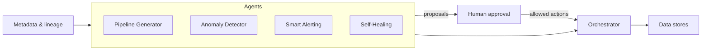
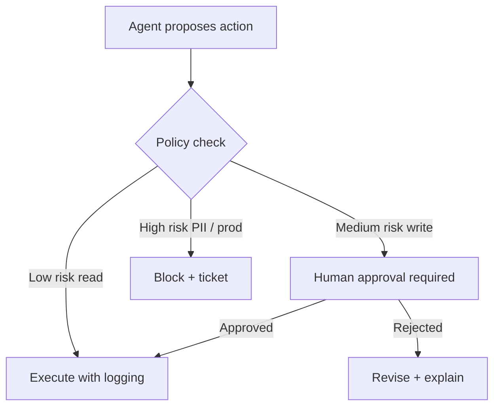

# Agentic AI for Data Engineering

**Role:** Architect / proposal lead  
**Context:** I presented a vision and concrete framework to data leadership at a global technology organization: **what if the data platform could engineer more of itself**-reducing toil while keeping humans accountable for risk, semantics, and compliance?

---

## Executive summary

I diagnosed chronic toil across data teams-**manual pipeline creation**, **reactive incident firefighting**, **ad-hoc quality checks**, and **repetitive SQL**-and proposed a **four-layer intelligent system** combining deterministic orchestration with **agentic AI** assistants bounded by guardrails. The framework was **designed and socialized** with leadership; projected impact included on the order of **~60% reduction in boilerplate** work for well-scoped tasks (generation, templating, first-pass investigation), with humans retaining approval for anything customer- or regulator-facing.

---

## The problem

Modern data platforms are rich but labor-intensive:

- Every new source seems to require **the same DAG skeleton** with slightly different parameters.  
- Incidents arrive as **unstructured alerts**; engineers repeat the same triage queries.  
- **Data quality** is often checked manually when a dashboard looks “off.”  
- **SQL** for exploration is valuable but repetitive when patterns repeat across domains.

The waste is not compute-it is **human attention** on tasks that are pattern-heavy yet safety-sensitive.

---

## Vision: agentic AI that maintains trusted infrastructure

**Agentic AI** here means autonomous or semi-autonomous **agents** with tools: they can read metadata, run approved queries, open tickets, propose pipeline changes, and **stop** when confidence or policy thresholds fail-not a chatbot that suggests SQL in a vacuum.

The north star: **AI agents that help maintain trusted data infrastructure** under explicit boundaries:

- Agents **propose** and **draft**; humans **approve** deploys that touch production semantics.  
- Agents **instrument** and **observe**; humans **define** SLAs and escalation policy.  
- Agents **heal** within safe envelopes (retries, backfills); humans **own** schema contracts and PII policy.

---

## Four components of the framework

### 1. Pipeline Generator (natural language → complete DAG)

**Input:** Plain-language intent (“daily incremental load from CRM object X with SCD2 history”).  
**Output:** A **complete directed acyclic graph** scaffold-tasks, dependencies, parameters, tests, and documentation stubs-aligned to organizational templates.

### 2. Anomaly Detector (statistical, seasonality-aware)

**Behavior:** Monitors volume, latency, null rates, and key business metrics with **seasonality** (dow, month-end, campaign spikes) to reduce false positives.  
**Output:** Ranked anomalies with **context** (which segment moved, when it started).

### 3. Smart Alerting (priority routing + root-cause suggestions)

**Behavior:** Classifies severity using **downstream blast radius** (consumer count, executive dashboards) and routes:

- Critical paths → immediate channels  
- Noisy signals → digest or suppression with justification  

**Adds:** **Root-cause suggestions** grounded in recent deploys, partition gaps, and upstream job failures-not guesses.

### 4. Self-Healing Orchestrator (retry, drift, backfill)

**Behavior:** Within policy:

- **Auto-retry** with backoff for transient failures  
- **Schema drift handling** (quarantine new columns, notify owners, optional auto-map when safe)  
- **Automatic backfill** windows when late-arriving data is detected  

**Guardrail:** Anything that changes **business meaning** or **PII exposure** escalates to humans.

---

## ASCII architecture: the framework

```
                         ┌─────────────────────────────┐
                         │   HUMAN GOVERNANCE LAYER     │
                         │  policies, approvals, RBAC   │
                         └──────────────┬──────────────┘
                                        │
    ┌───────────────────────────────────┼───────────────────────────────────┐
    │                     AGENTIC DATA PLATFORM                            │
    │                                                                        │
    │   ┌─────────────┐   ┌─────────────┐   ┌─────────────┐   ┌──────────┐ │
    │   │ Pipeline    │   │ Anomaly     │   │ Smart       │   │ Self-     │ │
    │   │ Generator   │   │ Detector    │   │ Alerting    │   │ Healing   │ │
    │   │ NL → DAG    │   │ stats +     │   │ P1/P2/P3    │   │ retry /   │ │
    │   │             │   │ seasonality │   │ routing     │   │ backfill  │ │
    │   └──────┬──────┘   └──────┬──────┘   └──────┬──────┘   └─────┬────┘ │
    │          │                 │                 │                │      │
    │          └─────────────────┼─────────────────┼────────────────┘      │
    │                            ▼                                         │
    │              ┌─────────────────────────────┐                        │
    │              │   METADATA & LINEAGE STORE     │                        │
    │              │   (schemas, jobs, costs, SLAs) │                        │
    │              └─────────────────────────────┘                        │
    │                            │                                         │
    │                            ▼                                         │
    │              ┌─────────────────────────────┐                        │
    │              │   ORCHESTRATOR / RUNTIME     │                        │
    │              │   (tasks, sensors, callbacks)│                        │
    │              └─────────────────────────────┘                        │
    └────────────────────────────────────────────────────────────────────────┘
                                        │
                                        ▼
                         ┌─────────────────────────────┐
                         │   WAREHOUSE / LAKE / STREAMS │
                         └─────────────────────────────┘
```

### Mermaid: agent loop (bounded)



---

## Intelligence capabilities (summary)

| Capability | Intended effect |
|------------|-----------------|
| **NL → SQL / NL → DAG** | Large reduction in repetitive authoring for standard patterns (**~60% boilerplate reduction** projected for eligible workloads) |
| **Proactive anomaly detection** | Fewer surprises; issues found before consumers do |
| **Root-cause suggestion** | Faster mean time to understand; less log-diving |
| **Pipeline template generation** | Consistent structure, embedded tests, faster onboarding |
| **Data quality scoring** | Trend visibility; prioritization of fixes |

These are **multipliers** when paired with strong **data contracts** and **observability**; they are not replacements for domain expertise.

---

## How this ties to agentic AI

Traditional automation runs **fixed rules**. Agentic systems **plan**, **use tools**, and **iterate** within constraints:

- An agent might **inspect** lineage, **compare** today’s row counts to seasonal baselines, **query** upstream freshness, and **open** a ticket with a suggested owner-stopping if evidence is inconclusive.  
- Another might **generate** a pipeline PR and **attach** a checklist of required reviews.

The critical design choice is **not** model size-it is **tool permissions**, **audit logs**, and **human gates**.

---

## Impact (to date)

- **Framework designed and proposed** to data leadership with a phased rollout (pilot domain → expand templates → broaden agent permissions).  
- **Projected ~60% reduction** in boilerplate for scoped tasks where templates and metadata are mature.  
- **Alignment conversations** sparked across data platform, security, and governance-surfacing policy gaps early.

---

## Lessons learned

1. **The hardest part is not the AI-it is drawing the boundary** between safe automation and judgment that must stay human (semantics, compliance, customer trust).  
2. **Metadata quality is the bottleneck.** Agents are only as good as catalogs, lineage, and SLAs are accurate.  
3. **Start with “suggest, don’t act”** in production until metrics prove false-positive rates are tolerable.  
4. **Cost and rate limits matter** at scale; intelligent systems need budgets like any other workload.

---

## Risks I called out explicitly

- **Over-automation** of schema changes without strong contracts  
- **Prompt-driven SQL** without mandatory review for regulated datasets  
- **Opacity:** every agent action needs traceability for auditors and incident review  

---

## Next steps (if implemented)

- Pilot on **non-PII** domains with **read-only** tools first  
- Pair with **data observability** and **incident runbooks**  
- Measure **time-to-first-PR** and **alert noise ratio** as leading indicators  

---

## Traditional automation vs. agentic assistance

| Dimension | Classic rules / scripts | Agentic approach (bounded) |
|-----------|-------------------------|----------------------------|
| **Trigger** | Fixed schedule or threshold | Contextual plan across signals |
| **Flexibility** | Brittle without new code | Adapts within tool + policy envelope |
| **Risk** | Predictable, narrow blast radius | Higher upside; needs stronger guardrails |
| **Explainability** | Often straightforward | Requires structured logs of tool calls |
| **Best for** | Deterministic SLAs | Triage, drafting, repetitive investigation |

I positioned agents as **accelerators on top of** contracts and observability-not as replacements for them.

---

## Phased rollout I recommended

**Phase 0 - Preconditions**

- Inventory **metadata completeness** (schemas, owners, PII tags).  
- Standardize **pipeline templates** so generated DAGs have a landing zone.

**Phase 1 - Read-only copilots**

- NL → SQL with **mandatory human execution** in lower environments.  
- Alert enrichment that **suggests** queries but does not run them without approval.

**Phase 2 - Drafting agents**

- NL → DAG PRs with **lint + policy checks** in CI.  
- Auto-generated **data quality tests** from column profiles (human approves merge).

**Phase 3 - Limited self-healing**

- Auto-retry, **safe** backfills, quarantine columns on drift.  
- Escalation paths for anything touching **semantic keys** or **external reporting**.

Skipping phases is how organizations learn about incident response the hard way.

---

## Success metrics (proposal)

I suggested measuring both **efficiency** and **safety**:

- **Median time** from “new source requested” to “first passing DAG in dev.”  
- **Fraction of incidents** where the first response included an auto-generated **hypothesis packet** (freshness, volume, upstream status).  
- **False-positive rate** for anomaly detection after seasonality tuning.  
- **Human override rate** - how often agents were wrong, and in which tool categories.

If override rates cluster in one tool, that is where **training data, prompts, or permissions** need tightening-not blanket distrust of the whole framework.

---

## Ethics and workforce framing

I was explicit with leadership: the goal is not **headcount reduction** in data engineering-it is **reallocating senior attention** to modeling, governance, and cross-functional judgment. Junior engineers should spend less time copy-pasting DAG scaffolding and more time learning **why** pipelines break and **how** contracts prevent recurrence.

Framing matters. **Agentic AI** proposals fail when teams hear “replacement” instead of **“exoskeleton.”**

---

## Mermaid: human-in-the-loop decision gate



---

## Closing thought

The proposal was energizing because it forced a discipline the industry often skips: **write down what “trusted automation” means** before buying tools or models. If I were pitching again tomorrow, I would start with **metadata SLAs** and **observability coverage**-the boring prerequisites that make intelligent systems legible.

---

*This case study describes a proposed architecture and organizational initiative using generalized terminology to protect confidentiality.*
