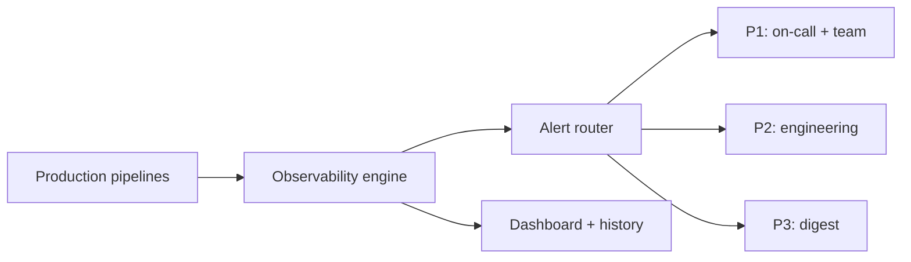
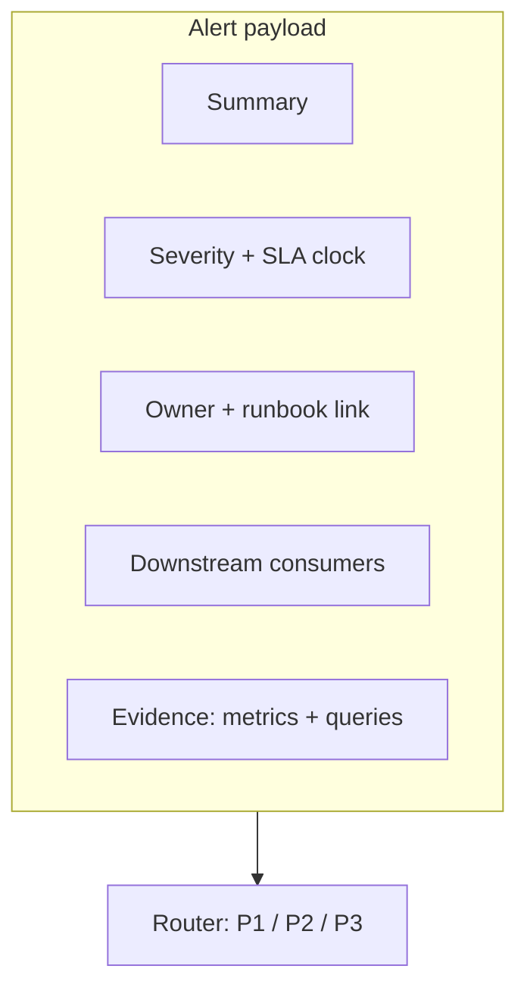

# Data Observability for Executive-Grade Pipelines

**Role:** Data engineer / observability owner  
**Context:** A data organization running **30+ production pipelines** feeding **C-suite dashboards** discovered failures only when **executives reported stale charts**. There was **no centralized observability**—each team owned fragments of monitoring, and on-call engineers lacked a single pane of glass or consistent alert semantics.

---

## Executive summary

I designed and implemented a **data observability layer** with **six standardized checks**, **tiered alert routing**, **historical tracking**, **downstream impact mapping**, and **cost visibility**. The outcome was **no surprise stale dashboards** for leadership consumers, a **sharp reduction in mean time to repair**, and a cultural shift: **data SLAs** became explicit **contracts** with stakeholders.

---

## The problem

- **Reactive discovery:** Pipelines failed silently or failed “loudly” in email threads nobody read.  
- **No shared SLA language:** “Fresh enough” meant different things to engineers and executives.  
- **Blast radius unknown:** When a fact table broke, nobody had a maintained map of **which dashboards and leaders** depended on it.  
- **Cost blind spots:** Expensive queries scaled with urgency, not value.

---

## Design principles

1. **Checks must be boring, comparable, and few**—not a hundred bespoke rules nobody maintains.  
2. **Alerts must route by severity** and **wake people only when necessary**.  
3. **History beats snapshots**—trending row counts and freshness build trust.  
4. **Downstream impact** is part of the alert payload, not an afterthought.

---

## Six monitoring checks

| Check | What it guards | Example policy |
|-------|----------------|----------------|
| **Pipeline status** | Job success / failure | **15-minute SLA** from expected start to terminal state |
| **Data freshness** | Latency of latest business data | **Under a few hours** relative to **10:00 UTC** business checkpoint |
| **Row count** | Volume shocks | Alert on **>30% deviation** vs trailing baseline (configurable window) |
| **Schema drift** | Breaking or silent structural change | Alert on **any** added/dropped/changed column on contracted tables |
| **Query cost** | Runaway spend | Threshold-based alerts on warehouse credits / scanned bytes |
| **Partition health** | Incomplete or duplicate partitions | Expectations on daily partitions present and non-overlapping |

Policies were tuned per dataset: **executive-critical** assets received stricter thresholds and louder routing.

---

## Alert routing

| Priority | Meaning | Routing |
|----------|---------|---------|
| **P1 Critical** | SLA breach affecting leadership or revenue reporting | **On-call** + **team incident channel** immediately |
| **P2 Warning** | Degradation, approaching SLA, or isolated domain issue | **Engineering channel** for owning team |
| **P3 Info** | Informational drift, cost nudges, non-urgent anomalies | **Daily digest** |

This stopped the failure mode where every anomaly pages everyone, which trains humans to ignore pages.

### Mermaid: observability topology



---

## Architecture (ASCII)

```
   ┌─────────────────────────────────────────────────────────────────┐
   │                    PRODUCTION PIPELINES (30+)                    │
   │   ingest → transform → mart → semantic layer → BI / exports      │
   └───────────────────────────────┬─────────────────────────────────┘
                                   │ metadata + metrics
                                   ▼
   ┌─────────────────────────────────────────────────────────────────┐
   │                   OBSERVABILITY ENGINE                            │
   │  • freshness monitors (watermarks)                              │
   │  • row count baselines                                            │
   │  • schema registry diff                                           │
   │  • cost telemetry                                                 │
   │  • partition completeness                                         │
   │  • job state / duration SLAs                                      │
   └───────────────────────────────┬─────────────────────────────────┘
                                   │
           ┌───────────────────────┼───────────────────────┐
           ▼                       ▼                       ▼
   ┌───────────────┐       ┌───────────────┐       ┌───────────────┐
   │ ALERT ROUTER  │       │ DASHBOARD     │       │ HISTORY STORE │
   │ P1 / P2 / P3  │       │ health scores │       │ trends, MTTR  │
   └───────┬───────┘       └───────────────┘       └───────────────┘
           │
           ▼
   ┌─────────────────────────────────────────────────────────────────┐
   │ ON-CALL / TEAMS / DIGESTS  +  DOWNSTREAM IMPACT IN MESSAGE      │
   └─────────────────────────────────────────────────────────────────┘
```

---

## Generic SQL example: freshness check

The following uses **generic** relation names to illustrate the **pattern**—compare the latest loaded timestamp to the current time and to a business deadline:

```sql
-- Illustrative freshness check (adapt warehouse dialect as needed)
WITH latest_load AS (
  SELECT MAX(loaded_at_utc) AS last_load_utc
  FROM analytics_curated.fact_orders_daily
)
SELECT
  last_load_utc,
  CURRENT_TIMESTAMP() AS now_utc,
  TIMESTAMP('2025-01-15 10:00:00 UTC') AS business_deadline_utc,
  CASE
    WHEN last_load_utc < TIMESTAMPADD(HOUR, -4, CURRENT_TIMESTAMP()) THEN 'FAIL_FRESHNESS'
    WHEN last_load_utc < TIMESTAMP('2025-01-15 10:00:00 UTC') THEN 'WARN_APPROACHING_DEADLINE'
    ELSE 'OK'
  END AS freshness_status
FROM latest_load;
```

In production, the **deadline** and **window** were parameterized per dataset; **10:00 UTC** was a leadership reporting anchor for this organization.

---

## Key features delivered

- **24/7 monitoring** across the pipeline fleet—not only “office hours” batch checks.  
- **Intelligent alerting:** severity derived from SLA + **downstream consumer map** (which dashboards, which exec metrics).  
- **Historical tracking:** row counts, freshness, failures, and cost stored for retrospectives and capacity planning.  
- **Downstream impact mapping:** every critical alert included **who is affected** and **which assets** to communicate about.  
- **Cost monitoring:** spikes tied to model or query pattern, encouraging healthy defaults (partition pruning, clustering, materializations).

---

## Operating model

- **Owners per dataset:** named engineers responsible for thresholds and exceptions.  
- **Runbooks:** for each P1 scenario—where to look first, how to backfill, who to notify.  
- **Weekly review:** P3 trends that might become P2 next week (cost creep, slowly lengthening freshness).

---

## Impact

- **Zero surprise stale dashboards** relative to the prior reactive baseline—issues were detected and owned before executives opened their morning packs.  
- **Mean time to repair reduced by ~70%** through faster routing, better context, and fewer duplicate investigations.  
- **Production trust:** data became something the organization believed would be **there on time**, not “probably updated.”  
- **Cost visibility:** finance and engineering could discuss tradeoffs with shared metrics.

---

## Lessons learned

1. **The best observability system is the one that lets humans sleep**—because noise is low and true emergencies are unmistakable.  
2. **Data SLAs are contracts with stakeholders.** Writing them down ended endless debates about “how fresh is fresh enough.”  
3. **Schema drift alerts feel noisy until the day they save you** from silently wrong revenue.  
4. **Downstream impact in the alert body** is cheaper than cross-team chaos during an incident.

---

## What I would add in a second phase

- **Synthetic probes:** tiny canonical queries that mimic executive dashboard filters to catch semantic breakage row-count checks miss.  
- **Automatic lineage import** from the BI layer so new dashboards inherit dependencies without manual registration.

---

## Implementation notes (stack-agnostic)

I implemented the engine so it could be **ported** across common warehouse and orchestration stacks:

- **Sensors** on orchestrator task state for **pipeline status** and duration SLAs.  
- **Watermark tables** or **max(partition) / max(load_ts)** probes for **freshness**.  
- **Baseline tables** storing trailing **row count** statistics with simple z-score or percentage thresholds.  
- **Information schema** or **contract tests** for **schema drift**.  
- **Warehouse query history** exports for **cost** monitoring.  
- **Partition catalogs** or file inventory checks for **partition health**.

The unifying idea: **centralize probes**, **normalize outputs** into a single **incident model**, then **route** consistently.

---

## SLA catalog example (illustrative)

Not every dataset earned the same bar. I maintained a **catalog** (conceptually) like:

| Asset class | Freshness target | Row-count sensitivity | Page policy |
|-------------|------------------|------------------------|-------------|
| Executive revenue mart | Strict morning deadline | High | P1 on breach |
| Operational KPIs (internal) | Same day | Medium | P2 |
| Experimental sandbox | Best effort | Low | P3 digest only |

Publishing this catalog ended implicit arguments about whether a given failure “mattered.”

---

## Generic incident narrative (composite)

A failure mode we eliminated looked like this—**composite story**, not a single event:

1. An upstream extract stalled overnight.  
2. A daily mart still “succeeded” with **partial partitions**.  
3. Row counts looked plausible at a glance.  
4. An executive dashboard showed **Friday’s numbers on Monday morning**.

After observability was in place, the sequence became:

1. **Partition health** fired **P2** when the expected partition was missing.  
2. **Freshness** escalated to **P1** as the **10:00 UTC** checkpoint approached.  
3. The alert named **downstream dashboards** and the **owning engineer**.  
4. **MTTR** dropped because nobody started from “which pipeline even feeds that tile?”

---

## Correlation across checks

Individual checks are weak alone; **correlation** is strong:

- **Schema drift** + **row count drop** often indicates a **breaking upstream change**.  
- **Cost spike** + **freshness lag** can indicate a **bad join** or **missing prune**.  
- **Pipeline green** + **freshness red** catches **silent partial success**—the subtlest class of bug.

I encoded lightweight **compound rules** so on-call engineers received **one coherent story** instead of three unrelated pages.

---

## Mermaid: incident payload structure



---

## Relationship to data contracts

Observability without contracts devolves into whack-a-mole. I paired monitors with **declared expectations**:

- Required columns and types for **contracted** tables.  
- Allowed **null rates** for critical keys (where business rules permitted).  
- Expected **load cadence** (daily vs hourly).

When contracts lived in repo-reviewed artifacts, **schema drift alerts** were not surprises—they were **enforcement**.

---

## Reflection

Building this system felt like installing **smoke detectors** in a house that had only ever relied on “someone smelled smoke.” The technology was straightforward; the cultural shift—**owning SLAs explicitly**—was the durable win.

---

*This case study describes real work using generalized terminology to protect confidentiality.*
