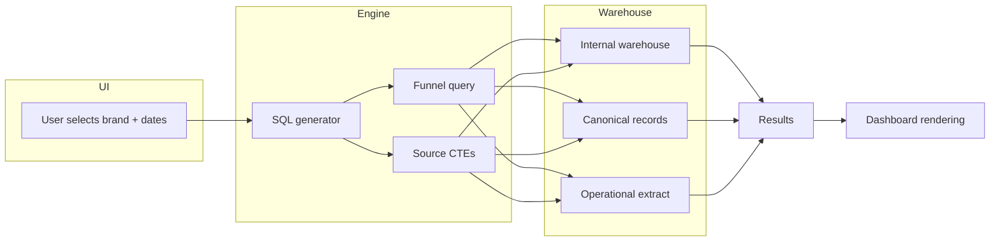

# Real-Time Billing Reconciliation Tool — Built in 24 Hours

**Role:** Data engineer — sole builder (architecture, SQL, application, deployment)
**Context:** A global subscription software company operating multiple consumer brands needed to validate billing data consistency across independent source systems before a critical operational handoff. No reconciliation tooling existed. I designed, built, and shipped a production-grade interactive reconciliation dashboard in a single 24-hour sprint.

---

## Executive summary

Three independent data sources each held a version of "the truth" for subscription billing: an **internal data warehouse**, a **third-party subscription management platform**, and a **team-provided operational extract**. Discrepancies between them were discovered manually, argued about in meetings, and resolved weeks later — if at all. I built a **self-service reconciliation tool** that runs **live warehouse queries**, compares **millions of subscription records** across all three sources, and surfaces mismatches — down to the individual record — with drill-down, export, and percentage-based gap analysis. The entire tool — architecture, SQL engine, interactive UI, multi-brand support — was built and deployed in **under 24 hours**.

---

## The problem

### No single source of truth

Each team trusted a different system:

| Source | What it contained | Who trusted it |
|--------|-------------------|---------------|
| **Internal data warehouse** | Enriched order and subscription records from the company's commerce platform | Data engineering, analytics |
| **Canonical record system** | Aggregated customer lifecycle data — the "golden record" | Product, finance |
| **Operational team extract** | Billing schedules, opt-in/opt-out flags, and renewal dates from the subscription management vendor | Operations, billing team |

These systems were **independently maintained** with different refresh cadences, identifiers, and business logic. Nobody knew how far apart they had drifted.

### Manual reconciliation was failing

- Engineers ran **ad-hoc SQL** to spot-check discrepancies, but results were not reproducible or shareable.
- Stakeholders received **conflicting numbers** in meetings and spent the first 20 minutes debating data instead of making decisions.
- There was **no tooling** to compare fields side-by-side across sources, quantify gaps, or drill into individual mismatches.
- The problem compounded across **multiple brands**, each with its own table structures and identifier conventions.

### Pressure was immediate

An upcoming billing cycle review required validated metrics across all sources. The team had **no tool, no process, and no time**. I volunteered to build one.

---

## What I built

An interactive, self-service reconciliation dashboard that:

1. **Compares any two sources** — users pick a comparison pair from a dropdown and set a date range.
2. **Runs live warehouse queries** — no pre-computed snapshots; results reflect current data.
3. **Produces a structured executive summary** — one table showing matched counts, gap counts, and gap percentages for every metric dimension.
4. **Supports drill-down** — every metric row expands to show sample records, downloadable as CSV.
5. **Covers multiple brands** — same tool, same UI, brand-specific SQL generated dynamically.
6. **Handles five comparison dimensions** — subscription presence, order counts, billing dates, expiration dates, and opt-in/opt-out status.

---

## Architecture

```
┌─────────────────────────────────────────────────────────────────────────────┐
│  USER INTERFACE (Streamlit)                                                  │
│  Brand selector · Comparison pair picker · Date range inputs                 │
│  Executive summary table · Drill-down expanders · CSV export                 │
└──────────────────────────────────┬──────────────────────────────────────────┘
                                   │  user triggers query
                                   ▼
┌─────────────────────────────────────────────────────────────────────────────┐
│  QUERY ENGINE (Python)                                                       │
│  Dynamic SQL generation · Parameterized CTEs · Safe type coercion            │
│  Funnel query builder · Source-specific CTE factory                           │
└──────────────────────────────────┬──────────────────────────────────────────┘
                                   │  generated SQL
                                   ▼
┌─────────────────────────────────────────────────────────────────────────────┐
│  CLOUD DATA WAREHOUSE                                                        │
│  Internal warehouse tables · Canonical record tables · Operational extracts  │
│  Live execution — no materialized views or pre-aggregation                   │
└──────────────────────────────────┬──────────────────────────────────────────┘
                                   │  result sets
                                   ▼
┌─────────────────────────────────────────────────────────────────────────────┐
│  RENDERING LAYER                                                             │
│  Metric table with conditional formatting · Expandable detail sections       │
│  Pie charts for field-level comparisons · Download buttons                   │
└─────────────────────────────────────────────────────────────────────────────┘
```

### Mermaid: data flow



---

## The funnel query pattern — the core innovation

The most critical comparison was between the internal warehouse and the operational team extract. These sources used **different identifier formats**, **different date representations**, and **different opt-in/opt-out encodings**. A naive join on order IDs produced almost zero matches — the systems simply did not share that key.

I designed a **funnel query** architecture: a single SQL statement using chained CTEs that resolves identifiers to a common key (subscription identifier), deduplicates to the latest record per subscription, parses vendor-specific date formats, normalizes opt-in/opt-out codes, and then computes **every comparison metric** in one pass.

```
┌─────────────────────────────────────────────────────────────────────────────┐
│  FUNNEL QUERY (single SQL statement)                                         │
│                                                                              │
│  ┌─────────────┐   ┌─────────────┐   ┌──────────────┐   ┌──────────────┐  │
│  │ Warehouse   │   │ Warehouse   │   │ Operational  │   │ Operational  │  │
│  │ PSNs        │   │ PSNs (all)  │   │ extract PSNs │   │ expiration   │  │
│  │ (filtered)  │   │             │   │ + billing +  │   │ data         │  │
│  │ + billing   │   │             │   │ opt status   │   │              │  │
│  │ + opt       │   │             │   │              │   │              │  │
│  │ + expiry    │   │             │   │              │   │              │  │
│  └──────┬──────┘   └──────┬──────┘   └──────┬───────┘   └──────┬───────┘  │
│         │                 │                 │                  │           │
│         └─────────────────┼─────────────────┘                  │           │
│                           ▼                                    │           │
│                  ┌─────────────────┐                           │           │
│                  │    MATCHED      │◄──────────────────────────┘           │
│                  │  (inner join    │                                       │
│                  │   on sub ID)    │                                       │
│                  └────────┬────────┘                                       │
│                           │                                                │
│                           ▼                                                │
│  ┌────────────────────────────────────────────────────────────────────┐    │
│  │  UNION ALL: 20+ metric rows                                        │    │
│  │  • Present in source A / B / both                                  │    │
│  │  • Billing date: match / mismatch / NULL variants                  │    │
│  │  • Opt status: match / directional mismatches / NULL variants      │    │
│  │  • Expiration: match / mismatch / NULL variants                    │    │
│  └────────────────────────────────────────────────────────────────────┘    │
└─────────────────────────────────────────────────────────────────────────────┘
```

### Why a single statement matters

- **Atomicity** — all metrics are computed from the same snapshot; no drift between separate queries.
- **Performance** — the warehouse scans each table once; CTEs are reused across all UNION ALL branches.
- **Maintainability** — adding a new comparison dimension means adding one CTE column and one UNION ALL block.

---

## Five comparison dimensions

| Dimension | What it measures | Why it matters |
|-----------|-----------------|----------------|
| **Subscription presence** | Which records exist in Source A vs Source B | Detects missing migrations, sync failures, orphaned records |
| **Order counts** | Matched orders by composite key | Validates end-to-end data flow between commerce and billing |
| **Next billing date** | Date the customer will next be charged | Billing date drift causes incorrect renewal forecasts |
| **Opt-in / opt-out status** | Customer consent and auto-renewal preference | Mismatches risk unauthorized charges or missed renewals |
| **Expiration date** | When the subscription license expires | Affects entitlement enforcement and retention campaigns |

For each dimension, the tool reports:

- **Total** in the left source
- **Matched** in the right source
- **Gap / mismatch count** with breakdown
- **Gap percentage**

---

## Handling real-world data quality challenges

### Identifier mismatches

The two primary sources used different column types for the subscription identifier — one stored it as a numeric type, the other as a string. Joins silently returned zero rows. I applied **explicit type normalization** at the CTE level so the join key was always a consistent string representation.

### Date format parsing

The operational extract stored dates in a non-standard vendor format (e.g., `09-APR-26 12.00.00.000000 AM`). I wrote **safe parsing logic** with fallback handling so malformed dates produced NULLs instead of query failures.

### Deduplication

The internal warehouse could contain multiple records per subscription (one per order event). The funnel query uses **window functions** (partitioned by subscription ID, ordered by recency) to select the **latest record** per subscription before comparison.

### NULL-aware comparisons

Missing data is as important as wrong data. Every comparison dimension reports:

- Match
- Mismatch (both values present, different)
- NULL in source A, value in source B
- Value in source A, NULL in source B
- NULL in both

This prevents "99% match" headlines that hide thousands of missing values.

### Opt-in/opt-out code translation

The two sources encoded consent differently — one used descriptive labels, the other used single-character codes with non-obvious mappings. I built a **translation layer** that normalizes both to a common boolean (opted in / opted out) before comparison, and the dashboard shows the **direction** of any mismatch (e.g., "Source A says opted out, Source B says opted in").

---

## Executive summary table (what stakeholders see)

The tool produces a single summary table per comparison pair:

| Metric | Total in Source A | Matched in Source B | Gap / Mismatch | Gap % |
|--------|------------------|--------------------|--------------------|-------|
| Subscription Presence | 123K (Extract) / 126K (Warehouse) | 114K matched | 9K in Extract not in Warehouse, 12K in Warehouse not in Extract | 15.7% |
| Next Billing Dates (matched) | 114K | 113.8K | 98 mismatch | 0.1% |
| Opt-In / Opt-Out Status (matched) | 114K | 70.5K | 43.4K gap (24 disagree + 43.4K NULL) | 38.1% |
| Expiration Dates (matched) | 114K | 111K | 2.6K mismatch | 2.3% |

Every row is expandable. Clicking reveals **sample records** with both source values side-by-side, downloadable as CSV for offline investigation.

---

## Drill-down and discrepancy analysis

### Subscription presence drill-down

For the "not found" buckets, the tool queries raw records from the source where the subscription exists but is absent in the other, showing all available fields so analysts can investigate root cause (late sync, incorrect filter, data retention gap).

### Billing and opt-status drill-down

For mismatches, the drill-down shows:

- Subscription identifier
- Source A value and Source B value side-by-side
- Difference (e.g., billing date gap in days)
- Directional labels for opt mismatches

### Field-level comparison tab

A dedicated tab provides **per-field** comparison with:

- Match / mismatch / missing counts
- Pie chart visualization
- Expandable sample tables for each category
- Separate date range controls

---

## Multi-brand support

The tool serves **multiple consumer brands** from the same interface. Each brand uses:

- Different warehouse tables with brand-specific schemas
- Different identifier column names
- Different vendor configurations

I built a **configuration layer** (YAML) that maps each brand to its table names, column names, join keys, and vendor-specific constants. Adding a new brand requires adding a config block and an SQL template — **zero application code changes**.

```yaml
# Generalized config structure
brands:
  brand_a:
    warehouse_table: "<project>.<dataset>.<table_a>"
    subscription_id_column: "sub_id_a"
    vendor_name_filter: "BRAND_A_CODE"
  brand_b:
    warehouse_table: "<project>.<dataset>.<table_b>"
    subscription_id_column: "sub_id_b"
    vendor_name_filter: "BRAND_B_CODE"
```

---

## Key technical decisions

| Decision | Rationale |
|----------|-----------|
| **Live queries, no pre-aggregation** | Reconciliation must reflect current state; stale snapshots defeat the purpose |
| **Single funnel query per brand** | Atomic metrics, single table scan, no inter-query drift |
| **Parameterized SQL templates** | Date ranges and brand-specific values injected at runtime; SQL files are reviewable and version-controlled |
| **Explicit type casting everywhere** | Eliminated silent join failures from implicit type coercion in the warehouse engine |
| **Window functions for deduplication** | Deterministic "latest record" selection without requiring a pre-materialized deduplicated table |
| **NULL-aware comparison taxonomy** | Prevents false confidence — a 99% match rate means nothing if 30% of records have NULL on one side |
| **Streamlit for UI** | Fastest path to an interactive, shareable dashboard without frontend engineering overhead |

---

## Agentic AI-assisted development

This tool was built in **24 hours** with the assistance of an **AI coding agent**. The human–AI collaboration followed a deliberate pattern:

| Phase | Human contribution | AI agent contribution |
|-------|-------------------|----------------------|
| **Problem definition** | Identified the reconciliation gap; defined which sources and fields to compare | — |
| **Architecture** | Designed the funnel query pattern; chose comparison dimensions | Generated initial SQL scaffolding |
| **Iteration** | Validated results against known-good queries; identified data quality issues | Debugged type coercion, refined CTEs, built drill-down queries |
| **UI** | Defined layout, metric grouping, UX flow | Generated Streamlit rendering code, wired up expanders and CSV exports |
| **Debugging** | Diagnosed a subtle implicit type coercion bug in the warehouse engine | Applied fix across all SQL files and dynamic query generators |
| **Deployment** | Final validation, push to production | Git operations, process management |

The 24-hour timeline was possible because the **human owned the architecture and validation** while the **AI handled the volume** — hundreds of lines of SQL, UI code, and configuration that would have taken days to write manually.

---

## Impact

- **Time to first reconciliation:** from **weeks of ad-hoc SQL** to **minutes** (select brand, set dates, click run).
- **Coverage:** **5 comparison dimensions** across **multiple brands** — previously zero were systematically tracked.
- **Data quality discovery:** immediately surfaced **~43K subscriptions** with NULL opt-in/opt-out status in the warehouse that the team did not know about.
- **Stakeholder trust:** the executive summary format ended "which number is right?" debates — both numbers are shown side-by-side with the gap quantified.
- **Reusable pattern:** the funnel query architecture is now the template for all future source-to-source comparisons.
- **Build time:** concept to deployed tool in **under 24 hours**, including debugging, multiple architectural iterations, and production deployment.

---

## Architecture decisions I would make again

1. **Funnel queries over multi-step ETL.** A single SQL statement that computes all metrics atomically is easier to audit, debug, and extend than a pipeline that materializes intermediate tables.

2. **Live execution over snapshots.** For reconciliation, freshness is non-negotiable. Pre-computed summaries hide the very discrepancies you are trying to find.

3. **NULL-aware comparison taxonomy.** Treating NULL as "not a mismatch" is the most common reconciliation mistake. Explicit NULL breakdowns changed the team's understanding of data quality overnight.

4. **Configuration-driven multi-brand support.** Every brand-specific value lives in one config file. The alternative — copy-pasting queries per brand — guarantees drift within weeks.

---

## Lessons learned

1. **The join key is the hardest part.** I spent more time resolving identifier mismatches (type coercion, deduplication, format normalization) than writing comparison logic. In any reconciliation project, **start with the join**.

2. **Implicit type coercion is a silent killer.** The warehouse engine silently converted types during joins inside CTEs with window functions, producing zero matches on data that clearly overlapped. Explicit casting everywhere is not paranoia — it is correctness.

3. **Stakeholders do not need dashboards — they need answers.** A single summary table with five rows told leadership more than a 20-slide deck. Drill-downs exist for the analysts; the executive view exists for decisions.

4. **24-hour builds are possible when architecture is right.** The funnel query pattern made everything downstream trivial — the UI just renders a status/count table. Choosing the right abstraction saved more time than any tool or framework.

5. **Agentic AI changes the economics of tooling.** Previously, a one-off reconciliation tool would not justify the engineering investment. With AI-assisted development, building purpose-built tools for operational problems becomes viable even under extreme time pressure.

---

## Technologies and patterns (generalized)

- **Cloud data warehouse** for live query execution against multiple source tables
- **SQL-first reconciliation** — funnel queries with chained CTEs and UNION ALL aggregation
- **Window functions** for deterministic deduplication (latest record per subscription)
- **Parameterized SQL templates** with placeholder substitution at runtime
- **Streamlit** for rapid interactive dashboard development
- **YAML configuration** for multi-brand support without code changes
- **Git-based SQL management** — query files versioned alongside application code
- **Agentic AI coding assistant** for high-velocity development

---

## What I would add with more time

- **Scheduled runs** with historical trend tracking — are gaps growing or shrinking?
- **Alerting thresholds** — notify the team when a metric crosses a configured tolerance.
- **Lineage integration** — link each comparison dimension to the upstream pipeline that populates it.
- **Automated regression** — run the funnel query on a schedule and flag when previously-matched records stop matching.

---

## Closing

This project reinforced a principle I return to often: **the best data tools are the ones that make disagreements impossible.** When two teams each have a number and no way to compare them, meetings become debates. When a tool shows both numbers, the gap, the percentage, and the individual records — there is nothing left to argue about. Only work to do.

Building it in 24 hours was a forcing function. It proved that with the right query architecture, configuration-driven design, and AI-assisted development, production-grade data tooling does not require a sprint — it requires **clarity about what question you are answering**.

---

*This case study describes real work using generalized terminology to protect confidentiality.*
